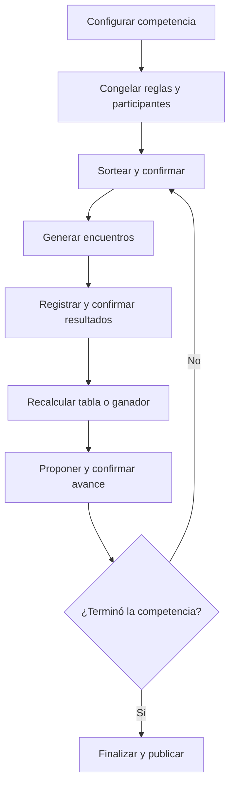

# Casos de uso — Sistema Web de Competencias OES

> **Estado:** Borrador funcional 0.1.0
> **Fecha:** 5 de agosto de 2026
> **Deriva de:** `FOUNDATION.md` 2.0.0, `docs/01-domain-model.md` 0.3.0, `docs/02-draw-rules.md` 0.3.0 y `docs/03-results-and-standings.md` 0.1.0
> **Autoridad:** Especificación funcional de interacción y autorización
> **Siguiente documento:** `docs/05-architecture.md`

## 1. Propósito

Este documento transforma las reglas del dominio en flujos operativos verificables para la aplicación web. Define quién puede iniciar cada acción, qué debe validar el servidor, qué estado se persiste y qué ve cada actor al terminar.

Los casos de uso no describen pantallas concretas ni contratos HTTP. La arquitectura, la API y la interfaz deberán implementar estos comportamientos sin debilitarlos.

## 2. Convenciones normativas

- **Debe** expresa una obligación.
- **No puede** expresa una prohibición.
- **Servidor** significa el componente autoritativo que valida y persiste.
- **Cliente web** significa un navegador no confiable; nunca decide permisos, resultados oficiales, puntajes, posiciones ni avances.
- **Revisión esperada** es el número de versión usado para control optimista de concurrencia.
- **Clave idempotente** identifica un intento lógico y evita duplicados ante reenvíos.
- **Operación crítica** exige registro de auditoría.

## 3. Actores

| Actor | Responsabilidad |
| --- | --- |
| Público | Consulta únicamente información oficialmente publicada. |
| Administrador | Configura competencias, registra participantes, ejecuta sorteos y presenta resultados o propuestas para confirmación. |
| Administrador confirmador | Revisa y confirma una acción crítica iniciada por otra autoridad. Es el mismo rol técnico de administrador, pero debe ser otra identidad. |
| Superadministrador | Posee las capacidades administrativas y, además, puede anular actos oficiales con motivo obligatorio. |
| Operador | Consulta encuentros y tablas y puede operar una presentación autorizada, sin capacidad de mutar el estado competitivo. |
| Sistema | Genera sorteos, encuentros, tablas, propuestas, evidencia y proyecciones de forma determinista. |

No se define en esta versión un rol de institución, árbitro o mesa deportiva con permisos de escritura. El operador tampoco posee comandos competitivos de escritura.

## 4. Matriz de autorización

| Acción | Público | Operador | Administrador | Superadministrador | Doble control |
| --- | :---: | :---: | :---: | :---: | :---: |
| Consultar contenido publicado | Sí | Sí | Sí | Sí | No |
| Consultar encuentros y tablas internos | No | Sí | Sí | Sí | No |
| Operar presentación | No | Sí | Sí | Sí | No |
| Crear y configurar competencia | No | No | Sí | Sí | No |
| Habilitar participantes | No | No | Sí | Sí | No |
| Congelar plantilla y competencia | No | No | Sí | Sí | No |
| Simular sorteo | No | No | Sí | Sí | No |
| Ejecutar sorteo oficial | No | No | Sí | Sí | No |
| Confirmar sorteo oficial | No | No | Otro administrador | Sí, si no lo inició | Sí |
| Publicar sorteo | No | No | Sí | Sí | No |
| Registrar resultado | No | No | Sí | Sí | No |
| Confirmar resultado | No | No | Otro administrador | Sí, si no lo registró | Sí |
| Confirmar clasificación o avance | No | No | Autoridad compatible | Autoridad compatible | Sí |
| Anular sorteo, resultado o avance | No | No | No | Sí | Motivo obligatorio |

Una misma identidad no puede ocupar los dos lados del doble control, aunque posea el rol de superadministrador.

## 5. Reglas transversales

Todos los comandos de escritura deben cumplir estas reglas:

1. El servidor autentica al actor y autoriza la acción.
2. El recurso pertenece a una única competencia identificada por edición, evento, deporte y modalidad.
3. El servidor valida la revisión esperada antes de modificar estado.
4. Las operaciones reintentables usan una clave idempotente.
5. La validación del navegador es solo una ayuda de experiencia; el servidor repite todas las validaciones.
6. Los cambios relacionados se confirman en una única transacción lógica.
7. Un fallo no deja estados parciales ni proyecciones oficiales inconsistentes.
8. Toda operación crítica registra actor, instante, acción, recurso, revisión, motivo cuando corresponda y correlación.
9. Las lecturas públicas nunca exponen borradores, secretos, semillas privadas, datos internos de auditoría ni acciones pendientes.
10. El sistema debe poder reconstruir el estado visible desde la base de datos después de cerrar el navegador, reiniciar el servidor o cambiar de dispositivo.

## 6. Ciclo funcional principal

En grupos, el retorno a sorteo ocurre después de confirmar los dos clasificados de cada grupo. En eliminación directa, ocurre después de confirmar los ganadores de la ronda. Cada nueva ronda eliminatoria se re-sortea según la Foundation.

## 7. UC-01 — Crear competencia

**Actor principal:** Administrador.
**Objetivo:** Crear la unidad competitiva aislada sobre la cual se operará.

### Precondiciones

- Existe una edición.
- Existen evento, deporte y modalidad habilitados.
- No existe otra competencia activa con la misma combinación.

### Flujo principal

1. El administrador selecciona edición, evento, deporte y modalidad.
2. El cliente envía la solicitud con clave idempotente.
3. El servidor valida identidad, permisos y unicidad.
4. El servidor crea la competencia en `BORRADOR`.
5. El servidor registra auditoría y devuelve identificador, revisión y estado.

### Excepciones

- Una combinación duplicada produce `COMPETITION_ALREADY_EXISTS`.
- Mezclar Colegiales y Universitarios produce `EVENT_BOUNDARY_VIOLATION`.
- Un reintento con la misma clave devuelve el mismo resultado.

### Postcondiciones

- La competencia queda persistida y reanudable.
- No puede sortearse todavía.

## 8. UC-02 — Configurar plantilla competitiva

**Actor principal:** Administrador.
**Objetivo:** Definir cómo se capturan resultados, se asignan puntos y se resuelven empates.

### Flujo principal

1. El administrador selecciona un perfil de resultado compatible con el deporte.
2. Configura política de desenlace y puntos de tabla.
3. Configura métricas habilitadas.
4. Ordena los criterios de desempate.
5. Configura cómo se obtiene un ganador eliminatorio.
6. El servidor valida que no existan valores implícitos, criterios desconocidos ni contradicciones.
7. El servidor guarda una revisión `DRAFT` y registra auditoría.

### Excepciones

- Una plantilla incompleta produce `RULE_SET_INCOMPLETE`.
- Un criterio no soportado produce `TIE_BREAK_CRITERION_UNSUPPORTED`.
- Editar una plantilla congelada produce `RULE_SET_FROZEN`.

### Postcondiciones

- La plantilla sigue editable hasta el congelamiento.
- Ningún puntaje ingresado manualmente reemplaza sus reglas.

## 9. UC-03 — Habilitar participantes

**Actor principal:** Administrador.
**Objetivo:** Construir la lista cerrada de equipos elegibles para una competencia.

### Flujo principal

1. El administrador selecciona instituciones o equipos.
2. El servidor verifica que cada participante pertenezca al evento correcto.
3. El servidor rechaza duplicados.
4. El servidor persiste las habilitaciones y actualiza la revisión.
5. La vista devuelve la lista canónica ordenada.

### Excepciones

- Participante repetido: `PARTICIPANT_DUPLICATED`.
- Participante de otra competencia o evento: `PARTICIPANT_OUTSIDE_COMPETITION`.
- Competencia bloqueada: `COMPETITION_LOCKED`.

### Postcondiciones

- Solo los participantes habilitados podrán incluirse en sorteos.

## 10. UC-04 — Seleccionar formato y parámetros

**Actor principal:** Administrador.
**Objetivo:** Configurar fase de grupos o eliminación directa antes de bloquear la competencia.

### Fase de grupos

1. El administrador elige manualmente la cantidad de grupos.
2. El servidor valida que cada grupo pueda contener entre tres y cuatro participantes.
3. Los lugares adicionales se asignarán automáticamente primero a A, luego B, C y siguientes.
4. No existen bombos ni cabezas de serie.

### Eliminación directa

1. El administrador selecciona eliminación directa.
2. El sistema determina si se requieren pases libres.
3. Los pases se sortearán aleatoriamente evitando repetir beneficiarios mientras existan participantes elegibles que no hayan recibido uno.
4. No existen bombos ni cabezas de serie.

### Excepciones

- Cantidad de grupos imposible: `INVALID_GROUP_COUNT`.
- Tamaño proyectado fuera de 3–4: `INVALID_GROUP_SIZE`.
- Parámetro incompatible con el formato: `DRAW_PARAMETER_INVALID`.

## 11. UC-05 — Bloquear competencia

**Actor principal:** Administrador.
**Objetivo:** Congelar participantes, plantilla y configuración para habilitar el sorteo oficial.

### Precondiciones

- La lista de participantes es válida.
- El formato y sus parámetros son completos.
- La plantilla competitiva es válida.
- No existe un sorteo oficial vigente.

### Flujo principal

1. El administrador solicita el bloqueo sobre una revisión esperada.
2. El servidor vuelve a validar todos los invariantes.
3. El servidor congela la plantilla como `FROZEN`.
4. El servidor fija la instantánea de participantes y parámetros.
5. La competencia pasa a `BLOQUEADA`.
6. Todo se persiste en una única transacción y queda auditado.

### Excepciones

- Si cualquier requisito falta, la transacción completa se rechaza.
- Una revisión obsoleta produce `CONCURRENCY_CONFLICT`.

## 12. UC-06 — Simular sorteo

**Actor principal:** Administrador.
**Objetivo:** Previsualizar el comportamiento sin producir efectos oficiales.

### Flujo principal

1. El administrador solicita una simulación.
2. El servidor ejecuta el motor con configuración válida y semilla de simulación.
3. Devuelve grupos, cruces o pases y advertencias aplicables.
4. Registra la simulación separada del historial oficial.

### Postcondiciones

- No se generan encuentros oficiales.
- No cambia el estado competitivo.
- No se publica ni reemplaza un sorteo confirmado.

## 13. UC-07 — Ejecutar y confirmar sorteo oficial

**Actores:** Administrador iniciador y otra autoridad confirmadora.
**Objetivo:** Producir un sorteo reproducible, auditable y oficial.

### Flujo principal

1. El iniciador solicita la ejecución oficial sobre una competencia bloqueada.
2. El servidor fija instantánea, compromiso, algoritmo, versión, orden canónico y evidencia.
3. El motor ejecuta `oes-draw-v1` y persiste el resultado pendiente.
4. Otra autoridad revisa participantes, parámetros y resultado.
5. El confirmador acepta exactamente la revisión pendiente, sin modificarla.
6. El servidor marca el sorteo `CONFIRMADO`.
7. En la misma transacción lógica, el sistema genera los encuentros derivados exactamente una vez.
8. El servidor registra ambas identidades y devuelve el estado confirmado.

### Excepciones

- La misma identidad intenta confirmar: `SELF_CONFIRMATION_FORBIDDEN`.
- Cambió la revisión: `CONCURRENCY_CONFLICT`.
- La competencia no está bloqueada: `COMPETITION_NOT_LOCKED`.
- Ya existe un sorteo vigente: `OFFICIAL_DRAW_ALREADY_EXISTS`.

### Postcondiciones

- En grupos se crean todos los pares no ordenados: tres encuentros para tres participantes y seis para cuatro.
- En eliminación se crea un encuentro por emparejamiento.
- Un pase libre avanza sin encuentro ficticio.

## 14. UC-08 — Publicar sorteo y encuentros

**Actor principal:** Administrador.
**Objetivo:** Exponer una versión oficial de consulta pública.

### Precondiciones

- El sorteo está confirmado.
- Los encuentros derivados existen.

### Flujo principal

1. El administrador solicita publicar una revisión confirmada.
2. El servidor crea una publicación inmutable identificable.
3. El sistema genera identificador, acta descargable y código verificable.
4. La vista pública pasa a mostrar grupos o cruces y encuentros lógicos.

### Postcondiciones

- No se exponen secretos, borradores ni acciones administrativas.
- La publicación puede verificarse contra la evidencia conservada.

## 15. UC-09 — Reanudar competencia

**Actor principal:** Administrador o superadministrador.
**Objetivo:** Continuar exactamente desde el estado persistido.

### Flujo principal

1. El actor abre la aplicación en cualquier dispositivo autorizado.
2. El cliente consulta el estado por identificador de competencia.
3. El servidor carga agregados y revisiones desde la base de datos.
4. Si una proyección falta o está desactualizada, el servidor la reconstruye desde hechos autoritativos.
5. La interfaz muestra el próximo comando permitido, pendientes de confirmación y bloqueos.

### Postcondiciones

- Ningún sorteo, encuentro o resultado se repite por pérdida de sesión.
- Las operaciones pendientes mantienen su autor y revisión originales.

## 16. UC-10 — Registrar resultado

**Actor principal:** Administrador.
**Objetivo:** Presentar un marcador o detalle deportivo para revisión independiente.

### Precondiciones

- El encuentro está en `AWAITING_RESULT`.
- La plantilla está congelada.
- Ambos participantes corresponden al encuentro.

### Flujo principal

1. El administrador abre el encuentro vigente.
2. Introduce los datos exigidos por `SCORE_BASED` o `SET_BASED`.
3. El cliente envía datos, revisión esperada y clave idempotente.
4. El servidor valida esquema, rangos, política deportiva y resolución eliminatoria cuando corresponda.
5. El servidor crea el resultado en `PENDING_CONFIRMATION`.
6. El encuentro pasa a `RESULT_PENDING`.
7. El servidor audita y notifica la existencia de una revisión pendiente dentro de la aplicación.

### Excepciones

- Marcador inválido: `INVALID_RESULT_SCHEMA`.
- El resultado eliminatorio no produce ganador: `KNOCKOUT_WINNER_UNRESOLVED`.
- Ya existe un resultado pendiente o vigente: `RESULT_ALREADY_EXISTS`.

### Postcondiciones

- La tabla, el ganador y el contenido público no cambian todavía.

## 17. UC-11 — Confirmar resultado

**Actor principal:** Otro administrador o superadministrador distinto del registrador.
**Objetivo:** Convertir un resultado revisado en hecho competitivo oficial.

### Flujo principal

1. El confirmador consulta el resultado pendiente y su evidencia.
2. Acepta la misma revisión sin editar valores.
3. El servidor valida separación de identidades y concurrencia.
4. El resultado pasa a `CONFIRMED`.
5. En la misma transacción, el servidor:
   - deriva desenlace y métricas;
   - recalcula la tabla completa del grupo, o determina el ganador eliminatorio;
   - actualiza el encuentro;
   - evalúa si puede calcularse una propuesta de avance;
   - registra auditoría.
6. La lectura pública se actualiza desde el nuevo estado oficial.

### Excepciones

- El registrador intenta confirmar: `SELF_CONFIRMATION_FORBIDDEN`.
- La revisión cambió: `CONCURRENCY_CONFLICT`.
- El resultado fue anulado o reemplazado: `RESULT_NOT_CONFIRMABLE`.

### Postcondiciones

- Los puntos nunca se capturan manualmente; se derivan de la plantilla congelada.
- Una tabla es una proyección reconstruible, no una fuente editable.

## 18. UC-12 — Consultar tabla y estado competitivo

**Actores:** Público y autoridades, con diferente nivel de detalle.
**Objetivo:** Ver posiciones y avance derivados de hechos confirmados.

### Flujo principal

1. El actor solicita una competencia o grupo.
2. El servidor devuelve la última proyección consistente con su revisión autoritativa.
3. La tabla muestra métricas derivadas, orden aplicado y estado de completitud.
4. Si faltan encuentros, se marca como parcial.
5. Si existe empate no resuelto, se muestra el bloqueo sin inventar un orden alfabético.

### Restricciones públicas

- El público ve resultados confirmados y publicaciones oficiales.
- No ve resultados pendientes, identidades internas, motivos reservados ni claves técnicas.

## 19. UC-13 — Calcular y confirmar clasificados de grupos

**Actores:** Sistema y autoridad confirmadora compatible.
**Objetivo:** Confirmar los dos mejores de cada grupo sin mejores terceros.

### Precondiciones

- Todos los encuentros necesarios tienen resultados confirmados.
- La tabla fue recalculada con la plantilla congelada.
- Ningún empate relevante permanece sin resolver.

### Flujo principal

1. El sistema ordena cada grupo aplicando los desempates congelados en secuencia.
2. Selecciona posición 1 y posición 2.
3. Crea una propuesta `PENDING_CONFIRMATION` con evidencia de tabla y criterios aplicados.
4. Una autoridad distinta del registrador del último resultado y de cualquier actor incompatible según permisos revisa la propuesta.
5. El confirmador acepta la misma revisión.
6. El servidor marca la clasificación `CONFIRMED` y habilita a los clasificados para la siguiente ronda.
7. La siguiente ronda eliminatoria queda preparada para un nuevo sorteo, no emparejada silenciosamente.

### Excepciones

- Encuentros pendientes: `GROUP_INCOMPLETE`.
- Empate no resuelto: `TIE_UNRESOLVED`.
- Actor incompatible: `QUALIFICATION_NOT_CONFIRMABLE`.

## 20. UC-14 — Confirmar ganadores de ronda eliminatoria

**Actores:** Sistema y otra autoridad confirmadora.
**Objetivo:** Consolidar los ganadores y preparar el re-sorteo de la ronda siguiente.

### Flujo principal

1. Cada resultado confirmado determina exactamente un ganador.
2. Los pases libres aportan su participante avanzado sin resultado artificial.
3. Cuando todos los cruces están resueltos, el sistema crea una propuesta de ganadores de ronda.
4. Una autoridad compatible distinta del registrador del último resultado confirma la propuesta.
5. El servidor cierra la ronda y crea el conjunto elegible para el próximo sorteo.
6. Si queda un solo participante, el sistema propone finalizar la competencia.

### Postcondiciones

- Los cruces de la próxima ronda no se derivan por posición fija; se generan mediante un nuevo sorteo oficial.

## 21. UC-15 — Anular y reemplazar resultado

**Actor principal:** Superadministrador.
**Objetivo:** Corregir un resultado oficial sin borrar su historia.

### Precondiciones

- Existe un resultado confirmado vigente.
- El actor proporciona un motivo no vacío.

### Flujo principal

1. El superadministrador selecciona el resultado y declara el motivo.
2. El servidor identifica tablas, propuestas, avances y rondas dependientes.
3. Si ya existe actividad posterior incompatible, el servidor bloquea la acción y devuelve el impacto requerido para una operación de reversión controlada.
4. Cuando es anulable, el servidor marca el resultado `ANNULLED`, nunca lo elimina.
5. Invalida propuestas o avances dependientes aún reversibles.
6. Recalcula la tabla desde los demás resultados confirmados.
7. El encuentro vuelve a `AWAITING_RESULT`.
8. Un nuevo resultado sigue UC-10 y UC-11 y queda vinculado al anterior.

### Postcondiciones

- Se conserva la cadena completa: original, anulación, motivo, actor y reemplazo.
- Ninguna tabla mantiene puntos derivados del resultado anulado.

## 22. UC-16 — Anular sorteo oficial

**Actor principal:** Superadministrador.
**Objetivo:** Invalidar un sorteo confirmado sin reescribir la historia.

### Flujo principal

1. El superadministrador selecciona el sorteo y proporciona motivo.
2. El servidor calcula el impacto sobre publicaciones, encuentros y resultados.
3. Si existen resultados confirmados o avances dependientes, la anulación simple se bloquea.
4. Si no existen efectos irreversibles, el servidor anula sorteo y publicación, e invalida encuentros sin resultados.
5. La competencia vuelve al estado permitido por las reglas para crear una nueva ejecución vinculada.

### Postcondiciones

- El sorteo anterior sigue siendo auditable como anulado.
- El reemplazo es una nueva ejecución con nuevo identificador y evidencia.

## 23. UC-17 — Finalizar competencia

**Actores:** Sistema y autoridad confirmadora.
**Objetivo:** Consolidar el ganador final y cerrar operaciones competitivas.

### Precondiciones

- La ronda final está resuelta.
- Existe un único ganador propuesto.
- No hay resultados ni confirmaciones críticas pendientes.

### Flujo principal

1. El sistema crea la propuesta final con trazabilidad completa.
2. Una autoridad compatible revisa la propuesta y confirma el avance final sin modificarlo.
3. El servidor confirma al ganador.
4. La competencia pasa a `FINALIZADA`.
5. Se publica el estado final y se conserva una instantánea verificable.

### Postcondiciones

- No se admiten nuevos sorteos ni resultados, salvo un procedimiento formal de anulación por superadministrador.

## 24. UC-18 — Verificar sorteo público

**Actor principal:** Público.
**Objetivo:** Comprobar que una publicación corresponde a un sorteo oficial conservado.

### Flujo principal

1. El público introduce o abre el código verificable.
2. El servidor localiza la publicación oficial.
3. Devuelve identificador, estado, competencia, versión del algoritmo, huella verificable y acta descargable.
4. La interfaz indica si la publicación está vigente, reemplazada o anulada.

### Restricciones

- La verificación no concede acceso administrativo.
- No revela semillas privadas antes de su momento autorizado ni información interna innecesaria.

## 25. Reglas de concurrencia e idempotencia

| Situación | Comportamiento obligatorio |
| --- | --- |
| Doble clic o reenvío de red | La misma clave devuelve el resultado previo. |
| Misma clave con contenido distinto | Se rechaza con `IDEMPOTENCY_CONFLICT`. |
| Dos actores modifican la misma revisión | Solo uno confirma; el otro recibe `CONCURRENCY_CONFLICT`. |
| Dos confirmaciones simultáneas | Se conserva una sola transición oficial. |
| Generación repetida de encuentros | Las claves por grupo/par o emparejamiento impiden duplicados. |
| Caída durante una operación | La transacción queda completa o no aplicada. |

## 26. Requisitos de experiencia web

1. La aplicación debe ser responsive en escritorio, tablet y móvil.
2. La interfaz debe mostrar competencia activa y frontera `Edición / Evento / Deporte / Modalidad` en toda operación administrativa.
3. Acciones de simulación, confirmación, publicación y anulación deben distinguirse visualmente.
4. Una acción irreversible debe mostrar impacto y exigir confirmación explícita.
5. Las pantallas deben mostrar estados reales del servidor, no estados optimistas como oficiales.
6. Los formularios deben conservar borradores locales solo como ayuda; nunca sustituyen la persistencia autoritativa.
7. Las vistas pendientes deben identificar qué acción espera una segunda autoridad sin exponer datos reservados al público.
8. Los errores deben ser accionables y conservar el contexto ingresado cuando sea seguro reintentarlo.
9. La interfaz pública debe priorizar grupos, llaves, encuentros, resultados y tablas sin controles administrativos.
10. La pérdida de conexión debe impedir presentar como confirmada una operación no reconocida por el servidor.

## 27. Lecturas mínimas requeridas

La futura API debe poder sostener, como mínimo, estas consultas:

- listar competencias por edición y evento;
- obtener resumen y próximo comando permitido de una competencia;
- consultar participantes y configuración congelada;
- consultar sorteo vigente, evidencia y publicaciones;
- consultar grupos, rondas, emparejamientos y pases libres;
- consultar encuentros por competencia, grupo, ronda y estado;
- consultar resultados confirmados y pendientes según permisos;
- consultar tabla parcial o final con criterios aplicados;
- consultar propuestas de clasificación o avance pendientes;
- consultar historial de anulaciones y reemplazos según permisos;
- verificar públicamente un código de sorteo.

## 28. Trazabilidad mínima

Cada operación crítica debe permitir responder:

- quién la inició;
- quién la confirmó, si aplica;
- cuándo ocurrió cada transición;
- sobre qué competencia y revisión;
- qué datos se usaron;
- qué regla y versión se aplicaron;
- qué registros o proyecciones produjo;
- qué operación anterior reemplaza o anula;
- por qué se anuló, cuando corresponda.

El registro de auditoría es anexable y no se edita como historial narrativo libre.

## 29. Criterios de aceptación funcional

La especificación se considera implementada cuando se demuestra que:

1. Una competencia puede crearse, cerrarse y reanudarse desde la base de datos.
2. Colegiales y Universitarios no pueden mezclarse mediante interfaz ni API.
3. Una plantilla incompleta no puede congelarse.
4. Los puntos y desempates no pueden cambiar después del bloqueo.
5. La cantidad manual de grupos solo se acepta si produce grupos de tres o cuatro.
6. Una simulación no crea efectos oficiales.
7. Un sorteo oficial no puede ser confirmado por su iniciador.
8. Confirmar el sorteo genera encuentros una sola vez.
9. Los grupos generan tres o seis encuentros según su tamaño.
10. Un pase libre no genera encuentro y evita repetición mientras haya elegibles.
11. Un resultado pendiente no modifica la tabla.
12. Un resultado no puede ser confirmado por quien lo registró.
13. Confirmar un resultado recalcula la proyección desde hechos confirmados.
14. La tabla no admite edición manual de puntos o posiciones.
15. Un empate sin criterio resolutivo bloquea la clasificación.
16. Los dos primeros de cada grupo requieren confirmación independiente.
17. Los ganadores eliminatorios se re-sortean en cada ronda.
18. Solo el superadministrador puede anular actos oficiales.
19. Una anulación preserva historia, motivo y dependencias.
20. Reintentos, concurrencia y fallos no producen duplicados ni estados parciales.
21. El público solo ve información confirmada y publicada.
22. El código público permite verificar el sorteo y su vigencia.

## 30. Escenarios de prueba de extremo a extremo

### E2E-01 — Grupo de cuatro

1. Crear y bloquear una competencia con cuatro participantes y un grupo.
2. Ejecutar y confirmar el sorteo con autoridades diferentes.
3. Verificar seis encuentros únicos.
4. Registrar y confirmar todos los resultados con separación de identidades.
5. Verificar tabla recalculada y criterios aplicados.
6. Confirmar los dos clasificados con otra autoridad.
7. Verificar que quedan elegibles para el sorteo eliminatorio.

### E2E-02 — Grupos desiguales válidos

1. Configurar una cantidad válida de grupos para una distribución 4/4/3.
2. Confirmar que A y B reciben primero los lugares adicionales.
3. Verificar 6, 6 y 3 encuentros respectivamente.
4. Completar resultados y comprobar dos clasificados por grupo, sin mejores terceros.

### E2E-03 — Eliminación con pase libre

1. Crear una ronda impar y ejecutar el sorteo.
2. Verificar un pase libre visible y ausencia de encuentro ficticio.
3. Completar cruces y confirmar ganadores.
4. Ejecutar la ronda siguiente y verificar que el historial de pases evita repetir beneficiario mientras haya otros elegibles.

### E2E-04 — Anulación de resultado

1. Confirmar resultados suficientes para producir una tabla y propuesta.
2. Anular uno como superadministrador con motivo.
3. Verificar invalidación de propuesta, recálculo y retorno del encuentro.
4. Registrar y confirmar el reemplazo.
5. Verificar nueva tabla y cadena de auditoría completa.

### E2E-05 — Concurrencia y recuperación

1. Abrir el mismo resultado pendiente con dos confirmadores.
2. Confirmar simultáneamente.
3. Verificar una sola transición oficial y un conflicto de revisión.
4. Interrumpir y reiniciar la sesión.
5. Verificar que el estado se restaura sin duplicar resultado, tabla ni encuentros.

## 31. Decisiones diferidas

Estos casos de uso no deciden:

- tecnología de autenticación;
- estructura de rutas HTTP o eventos en tiempo real;
- motor de base de datos;
- framework de interfaz;
- diseño visual final;
- asignación de fecha, hora, sede, cancha o árbitro;
- notificaciones externas;
- administración de deportistas.

Esas decisiones corresponden a arquitectura o a una ampliación explícita de alcance. No deben introducir comportamientos que contradigan los flujos definidos aquí.

## 32. Gate para arquitectura

`docs/05-architecture.md` solo puede considerarse válido si:

- asigna un dueño transaccional a cada caso de uso;
- trata al servidor y la base de datos como autoridad;
- impide que el cliente calcule decisiones oficiales;
- implementa separación de identidades para doble control;
- conserva idempotencia y concurrencia optimista;
- permite reconstruir tablas y publicaciones;
- mantiene aislada cada competencia;
- preserva trazabilidad y anulaciones;
- no incorpora silenciosamente funciones fuera de alcance.

Si una decisión técnica vuelve imposible cualquiera de estos puntos, la arquitectura debe cambiar; no se debilita el caso de uso para acomodar la tecnología.
