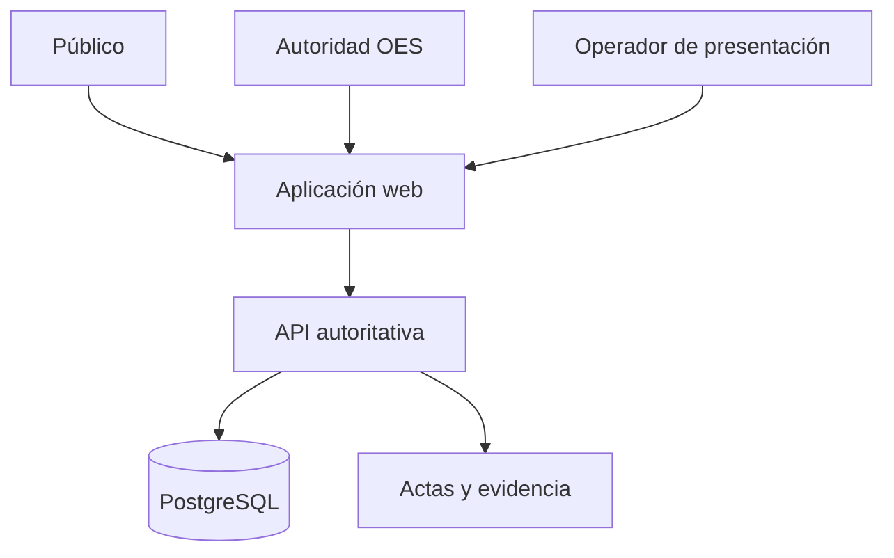

# Arquitectura — Sistema Web de Competencias OES

> **Estado:** Borrador técnico 0.1.0
> **Fecha:** 6 de agosto de 2026
> **Deriva de:** `FOUNDATION.md` 2.0.0 y `docs/01-domain-model.md` a `docs/04-use-cases.md`
> **Autoridad:** Arquitectura lógica, tecnológica y operativa del producto
> **Siguiente documento:** `docs/06-data-model.md`

## 1. Propósito

Este documento define cómo se estructura el Sistema Web de Competencias OES para implementar los casos de uso sin trasladar autoridad al navegador, perder trazabilidad ni fragmentar prematuramente el producto.

La arquitectura debe soportar el ciclo completo:

`configuración → sorteo → encuentros → resultados → tabla → avance → nueva ronda → finalización`

No sustituye el modelo físico de datos, los contratos HTTP detallados, el diseño visual ni el plan de implementación.

## 2. Decisión arquitectónica principal

El sistema será un **monolito modular web** dentro de un monorepo TypeScript:

- una aplicación Next.js para administración y consulta pública;
- una API NestJS como única frontera autoritativa de escritura;
- un núcleo de dominio TypeScript sin dependencia de framework;
- PostgreSQL como fuente de verdad;
- Prisma como acceso tipado y sistema de migraciones;
- un outbox persistente para efectos derivados y actualizaciones en tiempo real;
- almacenamiento de actas derivadas, inicialmente reproducibles desde datos persistidos.

No se adoptan microservicios. El volumen, el equipo y el alcance actual no justifican su costo de despliegue, consistencia distribuida, observabilidad y coordinación.

## 3. Principios arquitectónicos

1. El servidor decide; el navegador solicita y representa.
2. PostgreSQL conserva el estado autoritativo.
3. El dominio no depende de Next.js, NestJS, Prisma ni transporte.
4. Cada competencia mantiene una frontera estricta de aislamiento.
5. Las operaciones críticas son transaccionales, versionadas e idempotentes.
6. Las proyecciones pueden reconstruirse; los hechos confirmados no se reescriben.
7. La auditoría es parte de la operación, no un log opcional.
8. La publicación deriva del estado confirmado.
9. La actualización en tiempo real nunca crea autoridad paralela.
10. La arquitectura empieza simple y solo se distribuye cuando una medición lo exige.

## 4. Contexto del sistema



El público, los operadores y las autoridades utilizan la misma aplicación web con capacidades diferentes. Ningún rol se autoriza por una ruta o control visual; la API vuelve a verificar identidad, rol, competencia, estado y revisión.

## 5. Contenedores lógicos

| Contenedor | Responsabilidad | Puede escribir estado competitivo |
| --- | --- | :---: |
| Aplicación web | UI administrativa, UI pública, formularios, presentación y verificación cliente opcional | No |
| API | Autenticación, autorización, casos de uso, transacciones y contratos | Sí |
| Núcleo de dominio | Invariantes, estados, algoritmos, decisiones y eventos | Decide, no persiste directamente |
| Persistencia | Repositorios, transacciones, migraciones, outbox y proyecciones | Bajo comando de la API |
| Worker lógico | Consume outbox, actualiza derivados no críticos y distribuye eventos | Solo efectos autorizados |
| PostgreSQL | Estado autoritativo, auditoría, sesiones, idempotencia y proyecciones | Fuente de verdad |
| Generador de actas | Produce representación descargable desde evidencia confirmada | No cambia competencia |

En el MVP, la API y el worker pueden ejecutarse desde el mismo artefacto desplegable con procesos separados. No se requiere un servicio de colas externo.

## 6. Estructura del monorepo

```text
apps/
  web/                 Aplicación Next.js
  api/                 Aplicación NestJS y worker
packages/
  domain/              Agregados, políticas, eventos y motor de sorteos
  application/         Casos de uso, puertos y unidades de trabajo
  contracts/           DTO, esquemas, errores y eventos públicos
  database/            Prisma, migraciones y adaptadores PostgreSQL
  ui/                  Componentes visuales compartidos
  config/              Configuración común de TypeScript y herramientas
docs/                   Especificaciones normativas
```

### Reglas de dependencia

```text
apps/web -> packages/contracts + packages/ui
apps/api -> packages/application + packages/contracts + packages/database
packages/application -> packages/domain
packages/database -> packages/application + packages/domain
packages/domain -> ninguna capa de infraestructura
```

`apps/web` no importa `packages/domain` para ejecutar decisiones oficiales. Puede compartir tipos de contrato y verificadores públicos puros, pero no comandos autoritativos.

## 7. Stack tecnológico de referencia

| Área | Elección | Motivo |
| --- | --- | --- |
| Lenguaje | TypeScript estricto | Modelo compartido sin duplicar lenguajes |
| Monorepo | pnpm workspaces | Dependencias y paquetes internos explícitos |
| Web | Next.js + React | UI administrativa y pública responsive |
| API | NestJS | Módulos, validación, guards y composición clara |
| Base de datos | PostgreSQL | Transacciones, restricciones, JSON y consultas consistentes |
| ORM/migraciones | Prisma | Esquema tipado y migraciones revisables |
| Validación de contratos | Esquemas runtime compartidos | El tipo TypeScript no valida entrada externa |
| Tiempo real | Socket.IO o SSE desde eventos confirmados | Actualizar vistas sin convertir el canal en autoridad |
| Pruebas | Unitarias, integración PostgreSQL y E2E web | Verificar invariantes y recorridos reales |
| Contenedores | Docker | Reproducibilidad entre desarrollo y producción |

Las versiones exactas se fijarán en los manifiestos y archivo de lock al iniciar implementación. La arquitectura no depende de una versión pasajera del framework.

## 8. Módulos del servidor

| Módulo | Responsabilidad principal |
| --- | --- |
| Identity | Usuarios, credenciales, sesiones y estado de cuenta |
| Access | Roles, permisos y separación de identidades |
| Catalog | Ediciones, eventos, instituciones, deportes y modalidades |
| Competition | Competencia, participantes, bloqueo y finalización |
| RuleSet | Plantillas de resultados, puntos, métricas y desempates |
| Draw | Configuración, simulación, ejecución, confirmación y anulación |
| Match | Generación idempotente y consulta de encuentros |
| Result | Registro, confirmación, anulación y reemplazo |
| Standing | Recálculo y explicación de tablas |
| Advancement | Propuestas, confirmaciones y nuevas rondas |
| Publication | Publicaciones, códigos, actas y verificación |
| Audit | Consulta protegida de trazabilidad |
| Operations | Salud, outbox, restauración y tareas administrativas |

Los módulos son fronteras internas, no servicios desplegables independientes.

## 9. Núcleo de dominio

`packages/domain` contiene:

- identificadores y tipos de valor;
- estados y transiciones;
- agregados y políticas;
- `oes-draw-v1` como algoritmo puro;
- generación lógica de encuentros;
- derivación de desenlaces y métricas;
- cálculo de tablas y desempates;
- creación de propuestas de avance;
- eventos de dominio;
- errores normativos.

### Prohibiciones

El dominio no puede:

- ejecutar consultas SQL;
- leer variables de entorno;
- conocer solicitudes HTTP;
- iniciar sockets;
- generar UI;
- obtener la hora global directamente;
- producir aleatoriedad oculta;
- decidir permisos mediante datos del navegador.

Tiempo, identidad, semilla, revisiones y configuración llegan como entradas explícitas.

## 10. Capa de aplicación

`packages/application` implementa un manejador por comando o consulta relevante. Cada manejador:

1. recibe una identidad ya autenticada;
2. valida autorización contextual;
3. carga el agregado y su revisión;
4. invoca el dominio;
5. persiste cambios y outbox en una transacción;
6. registra auditoría;
7. devuelve un contrato estable.

La capa define puertos para repositorios, unidad de trabajo, reloj, generación segura de semilla, hashing, almacenamiento de actas y publicación de eventos. La infraestructura implementa esos puertos.

## 11. API autoritativa

### 11.1 Estilo

La API inicial será REST bajo `/api/v1`. Los nombres expresan recursos y acciones de dominio, no tablas de base de datos.

Ejemplos conceptuales:

```text
POST /api/v1/competitions
POST /api/v1/competitions/{id}/lock
POST /api/v1/draws/{id}/execute
POST /api/v1/draws/{id}/confirm
POST /api/v1/matches/{id}/results
POST /api/v1/results/{id}/confirm
GET  /api/v1/competitions/{id}/standings
POST /api/v1/advancements/{id}/confirm
GET  /api/v1/public/verifications/{code}
```

No son contratos finales; `docs/07-api-contracts.md` deberá fijarlos.

### 11.2 Metadatos obligatorios

Los comandos críticos transportan:

- sesión autenticada;
- `Idempotency-Key`;
- revisión esperada mediante cuerpo o `If-Match`;
- identificador de correlación;
- motivo cuando la operación es de anulación.

### 11.3 Errores

Los errores usan un formato uniforme compatible con Problem Details:

- código normativo estable;
- estado HTTP;
- título seguro;
- detalle accionable;
- correlación;
- revisión actual cuando sea seguro exponerla;
- errores de campos cuando corresponda.

La API no filtra stack traces, consultas SQL, secretos ni datos de otras competencias.

## 12. Aplicación web

La aplicación Next.js contiene dos superficies:

### 12.1 Administración

- autenticación y sesión;
- selector persistente de edición, evento, deporte y modalidad;
- configuración de competencia y plantilla;
- participantes;
- consola de sorteo y presentación;
- bandejas de confirmación;
- encuentros y carga de resultados;
- tablas, avances y auditoría autorizada.

### 12.2 Consulta pública

- competencias publicadas;
- grupos y llaves;
- encuentros y resultados confirmados;
- tablas publicadas;
- clasificados y ganadores confirmados;
- actas y verificación.

### 12.3 Estado del cliente

El cliente puede mantener estado de formulario y caché de lectura. Después de todo comando crítico debe reconciliar con la respuesta del servidor. Nunca marca una operación como oficial solo porque la solicitud fue enviada.

## 13. Autenticación y sesiones

La primera versión utiliza cuentas internas administradas por OES y sesiones opacas:

- identificador de sesión aleatorio;
- cookie `HttpOnly`, `Secure` y `SameSite` apropiada;
- sesión persistida con expiración, rotación y revocación;
- contraseña almacenada únicamente mediante hash resistente y sal individual;
- bloqueo o demora progresiva ante intentos fallidos;
- cierre de sesiones al deshabilitar una cuenta.

La API obtiene `actorId` y roles desde la sesión persistida, nunca desde campos enviados por el cliente.

La integración futura con un proveedor de identidad puede reemplazar la autenticación sin cambiar las reglas de autorización del dominio.

## 14. Autorización y doble control

La autorización combina:

- rol global;
- acción solicitada;
- competencia objetivo;
- estado del recurso;
- identidad del iniciador;
- identidad del confirmador;
- dependencias ya confirmadas.

Los guards de NestJS realizan un filtro inicial. El manejador y el dominio vuelven a validar las reglas críticas. Una restricción de base de datos o transacción impide que dos confirmaciones concurrentes violen la separación de identidades.

Ocultar botones en la interfaz mejora claridad, pero no constituye seguridad.

## 15. Persistencia

PostgreSQL guarda como mínimo:

- identidad, roles y sesiones;
- catálogo institucional;
- competencias y participantes;
- plantillas y revisiones congeladas;
- configuraciones y ejecuciones de sorteo;
- grupos, rondas, emparejamientos y pases libres;
- encuentros;
- revisiones de resultados;
- tablas y fuentes usadas;
- propuestas y confirmaciones de avance;
- publicaciones y evidencia;
- auditoría;
- claves idempotentes;
- eventos outbox.

El modelo físico y sus restricciones se definirán en `docs/06-data-model.md` antes de crear migraciones.

## 16. Estrategia transaccional

### 16.1 Operaciones atómicas

Deben completarse o revertirse como unidad:

- congelar plantilla, participantes y competencia;
- ejecutar un sorteo oficial único y conservar evidencia;
- confirmar sorteo y generar encuentros;
- confirmar resultado, recalcular tabla y evaluar propuesta;
- anular resultado e invalidar dependencias reversibles;
- confirmar avance y cerrar grupo o ronda;
- publicar una revisión confirmada con su evidencia.

### 16.2 Límites

Las transacciones no incluyen llamadas de red ni generación pesada de archivos. Esos efectos se registran en outbox y se ejecutan después, conservando reintentos seguros.

### 16.3 Aislamiento

Se usan:

- revisiones enteras para concurrencia optimista;
- restricciones únicas para invariantes estructurales;
- bloqueos de fila solo en comandos críticos concretos;
- reintentos acotados cuando PostgreSQL detecta conflicto serializable o deadlock.

## 17. Idempotencia

Cada comando crítico registra:

- actor;
- alcance o endpoint lógico;
- clave idempotente;
- hash de la intención normalizada;
- estado de procesamiento;
- respuesta o referencia resultante;
- expiración conforme a política.

La misma clave e intención devuelve el resultado original. La misma clave con otra intención produce `IDEMPOTENCY_CONFLICT`.

Las restricciones de unicidad del dominio siguen siendo obligatorias; la idempotencia no las sustituye.

## 18. Outbox y efectos derivados

La misma transacción que confirma un hecho agrega un evento a `outbox_events`. Un worker:

1. reclama eventos pendientes;
2. ejecuta el efecto derivado;
3. registra éxito o error;
4. reintenta con espera acotada;
5. mueve errores permanentes a revisión operativa.

Usos iniciales:

- regenerar acta descargable;
- invalidar caché pública;
- emitir actualización en tiempo real;
- reconstruir una proyección marcada como divergente.

El outbox no se usa para diferir decisiones que deben ser atómicas, como confirmar un resultado y recalcular su tabla.

## 19. Actualización en tiempo real

Socket.IO o SSE puede distribuir eventos de lectura como:

- sorteo publicado;
- encuentro actualizado;
- resultado confirmado;
- tabla recalculada;
- avance confirmado.

El mensaje contiene identificador, tipo y revisión. El cliente vuelve a consultar la API para obtener el estado completo cuando sea necesario.

La desconexión no afecta la operación. Al reconectar, el cliente consulta la revisión actual; no depende de haber recibido todos los eventos.

## 20. Sorteo y criptografía

El motor `oes-draw-v1` vive en `packages/domain` como función pura. La API aporta:

- instantánea canónica;
- semilla obtenida mediante fuente criptográficamente segura;
- compromiso previo;
- versión de algoritmo;
- contexto de ronda;
- historial de pases libres.

Los secretos se persisten cifrados o protegidos conforme a la política de operación y nunca se envían al navegador antes de su revelación autorizada. Los logs no incluyen semillas privadas.

La animación recibe un resultado ya persistido. No ejecuta un segundo sorteo visual.

## 21. Tablas y proyecciones

Las tablas almacenadas son proyecciones versionadas que incluyen:

- grupo;
- plantilla y revisión;
- resultados fuente;
- filas y métricas derivadas;
- criterios aplicados;
- estado parcial, ordenado o empate no resuelto;
- instante de cálculo.

Si la huella de fuentes no coincide, la proyección se descarta y reconstruye. No existe una ruta para modificar puntos o posiciones.

Las lecturas públicas pueden usar caché, pero una invalidación no puede hacer visible un resultado pendiente.

## 22. Actas, publicaciones y verificación

La publicación oficial se compone de:

- registro persistido e inmutable;
- identificador público;
- código verificable no predecible;
- carga canónica de evidencia;
- huella criptográfica;
- representación descargable.

El contenido canónico se conserva en PostgreSQL. El PDF puede generarse al publicar y almacenarse en objeto externo o regenerarse de manera determinista. El PDF no es la fuente de verdad.

Una publicación anulada continúa verificable con su estado y relación de reemplazo.

## 23. Auditoría

Cada entrada contiene:

- `auditId`;
- actor y rol efectivo;
- acción;
- tipo e identificador de recurso;
- competencia;
- revisión anterior y posterior;
- correlación;
- motivo cuando aplica;
- instante del servidor;
- metadatos seguros del origen.

La auditoría es anexable. No se actualiza ni elimina mediante operaciones normales. Los valores sensibles se excluyen o redactan antes de persistir.

## 24. Seguridad de aplicación

Controles mínimos:

- TLS en producción;
- cookies seguras y protección CSRF cuando corresponda;
- política CORS cerrada;
- validación runtime y límites de tamaño;
- consultas parametrizadas mediante Prisma;
- escape y política de contenido en la web;
- rate limiting en autenticación, verificación y comandos sensibles;
- cabeceras de seguridad;
- secretos fuera del repositorio;
- permisos mínimos para base de datos y despliegue;
- dependencias auditadas y actualizadas mediante PR;
- logs sin contraseñas, tokens, cookies o semillas privadas.

El sistema no acepta HTML arbitrario en observaciones ni nombres. Los archivos generados no ejecutan contenido aportado por usuarios.

## 25. Aislamiento de competencias

Toda entidad competitiva contiene o deriva un `competitionId`. Repositorios y consultas exigen esta frontera cuando el identificador aislado no sea suficiente.

Controles:

- claves foráneas que preservan pertenencia;
- restricciones compuestas donde un cruce accidental sea posible;
- autorización contextual por competencia;
- pruebas negativas entre Colegiales y Universitarios;
- cachés y canales en tiempo real con claves de competencia;
- auditoría del contexto seleccionado.

La interfaz debe mostrar permanentemente la competencia activa durante una operación administrativa.

## 26. Copias, restauración y continuidad

Antes de operación oficial deben existir:

- copias automáticas de PostgreSQL;
- retención definida;
- restauración ensayada en ambiente separado;
- verificación de integridad después de restaurar;
- respaldo de objetos publicados si se usa almacenamiento externo;
- procedimiento documentado de recuperación.

La aplicación debe tolerar reinicio sin repetir sorteos, encuentros, resultados ni confirmaciones. El outbox continúa desde eventos persistidos.

No se declara una copia válida hasta que una restauración de prueba haya demostrado que puede reconstruir una competencia completa.

## 27. Observabilidad

### Logs estructurados

- correlación;
- ruta o caso de uso;
- actor pseudonimizado cuando corresponda;
- competencia;
- duración;
- resultado y código de error;
- revisión.

### Métricas

- latencia y errores por caso de uso;
- conflictos de concurrencia;
- reintentos idempotentes;
- profundidad y antigüedad del outbox;
- fallos de generación de actas;
- tiempo de recálculo de tablas;
- conexiones en tiempo real;
- estado de backups y restauraciones ensayadas.

### Alertas iniciales

- API o base de datos no disponible;
- error sostenido en comandos críticos;
- evento outbox bloqueado;
- fallo de backup;
- restauración o integridad fallida;
- espacio o conexiones PostgreSQL cerca del límite.

## 28. Despliegue

### Ambientes

- `local`: desarrollo con datos descartables;
- `test`: integración automática aislada;
- `staging`: ensayo operativo con configuración equivalente;
- `production`: datos oficiales.

### Unidades desplegables

1. `web`: aplicación Next.js.
2. `api`: API NestJS.
3. `worker`: consumidor de outbox construido desde la API.
4. `postgres`: servicio administrado o instancia con operación formal.
5. almacenamiento de objetos opcional para PDFs.

### Reglas

- migraciones se ejecutan como paso controlado, no desde cada réplica al iniciar;
- el despliegue falla si la configuración requerida no está completa;
- staging y producción usan secretos distintos;
- no se copian datos oficiales a desarrollo sin anonimización;
- una versión debe poder revertirse sin revertir destructivamente datos ya migrados.

## 29. Rendimiento y escalabilidad

El problema inicial es pequeño en cantidad de participantes y encuentros. La prioridad es consistencia, no distribución.

Controles suficientes para el MVP:

- índices derivados de consultas reales;
- paginación de auditoría e historial;
- caché HTTP para publicaciones;
- conexión agrupada a PostgreSQL;
- cálculos de tabla dentro de la competencia o grupo, no globales;
- PDFs y notificaciones fuera de la transacción;
- medición antes de optimizar.

Solo se considerará separar servicios cuando existan métricas sostenidas que demuestren un cuello de botella o una necesidad real de aislamiento operativo.

## 30. Estrategia de pruebas

| Nivel | Objetivo |
| --- | --- |
| Unitarias de dominio | Estados, invariantes, sorteos, puntos, desempates y avances |
| Propiedades | Conservación, unicidad, determinismo y distribución válida |
| Integración | PostgreSQL real, restricciones, transacciones, Prisma y outbox |
| Contratos | Compatibilidad entre web, API y errores normativos |
| Seguridad | autorización, auto-confirmación, CSRF, límites y aislamiento |
| E2E | recorridos definidos en `docs/04-use-cases.md` |
| Recuperación | backup, restore, reanudación e idempotencia tras interrupción |

Las pruebas de integración no usan una base en memoria como sustituto único de PostgreSQL; diferencias de restricciones y aislamiento invalidarían la confianza.

## 31. Pipeline de calidad

Todo cambio implementado deberá superar, como mínimo:

1. formato y lint;
2. comprobación TypeScript estricta;
3. pruebas unitarias;
4. pruebas de contratos;
5. pruebas de integración afectadas;
6. validación de esquema Prisma y migraciones;
7. construcción de web y API;
8. análisis de dependencias y secretos;
9. `git diff --check`;
10. gates documentales aplicables.

Los cambios de migración, autorización, sorteo, resultados o puntajes requieren revisión explícita por su impacto.

## 32. Decisiones rechazadas

| Alternativa | Motivo de rechazo actual |
| --- | --- |
| Sorteo en navegador | Manipulable y no autoritativo |
| Base de datos solo en cliente | No permite control, restauración ni auditoría fiables |
| Firebase como lógica distribuida desde UI | Facilita dispersar invariantes y autoridad |
| Microservicios | Complejidad operativa sin escala que la justifique |
| Event sourcing completo | Costo de modelado y operación superior a la necesidad actual |
| Redis obligatorio | PostgreSQL y outbox cubren el MVP |
| Edición manual de tablas | Contradice la trazabilidad desde resultados |
| WebSocket como canal de comandos oficiales | Reconexión y entrega complican autoridad e idempotencia |
| PDF como fuente de verdad | No es consultable ni reconstruible de forma segura |

## 33. Riesgos arquitectónicos

| Riesgo | Control |
| --- | --- |
| Lógica duplicada entre web y API | Dominio exclusivo del servidor y contratos compartidos |
| Módulos se convierten en CRUD acoplado | Casos de uso y puertos explícitos |
| Transacciones demasiado grandes | Limitar hechos críticos y mover efectos a outbox |
| Prisma oculta consultas ineficientes | Medición, revisión SQL e índices reales |
| Confirmaciones simultáneas | Revisión, restricción y transacción |
| Tiempo real muestra estado obsoleto | Evento con revisión y reconciliación por API |
| Pérdida de evidencia | Persistencia canónica, hash, backup y restore |
| Exceso de abstracción | No crear interfaces sin consumidor o frontera real |
| Dependencia del framework | Dominio y aplicación fuera de NestJS/Next.js |

## 34. Secuencia de implementación

1. Modelo físico y restricciones en `docs/06-data-model.md`.
2. Contratos API y errores en `docs/07-api-contracts.md`.
3. Estructura del monorepo y gates mínimos.
4. Núcleo de identidad, sesiones y autorización.
5. Catálogo, competencia, participantes y plantillas.
6. Motor de sorteo y evidencia.
7. Generación de encuentros.
8. Resultados y tablas.
9. Avances y nuevas rondas.
10. Publicación, actas y verificación.
11. Auditoría, backups, restauración y operación.
12. Endurecimiento E2E y preparación de producción.

No se debe construir primero una interfaz completa con datos ficticios y luego intentar encajar el dominio. El orden correcto establece datos, contratos y reglas autoritativas antes de cerrar la UI operativa.

## 35. Gate de arquitectura

La arquitectura queda aprobable cuando se verifica que:

1. Todos los casos de uso tienen un módulo y dueño transaccional.
2. El navegador no puede producir estados oficiales por sí mismo.
3. PostgreSQL conserva la fuente de verdad y permite restauración.
4. El dominio puede probarse sin framework ni base de datos.
5. La doble autoridad se valida en servidor y transacción.
6. Sorteos, encuentros y resultados son idempotentes.
7. Las tablas se reconstruyen desde resultados confirmados.
8. El tiempo real es derivado y recuperable.
9. Auditoría y outbox se persisten con los hechos críticos.
10. Colegiales y Universitarios permanecen aislados.
11. Las anulaciones conservan historia y dependencias.
12. La solución no requiere microservicios ni infraestructura innecesaria.
13. Existen estrategias verificables de backup y restauración.
14. El siguiente modelo de datos puede expresar restricciones sin depender solo de código.

Si el modelo físico no puede implementar estos puntos, debe revisarse la decisión de datos; no se eliminan garantías para acomodar el ORM.
