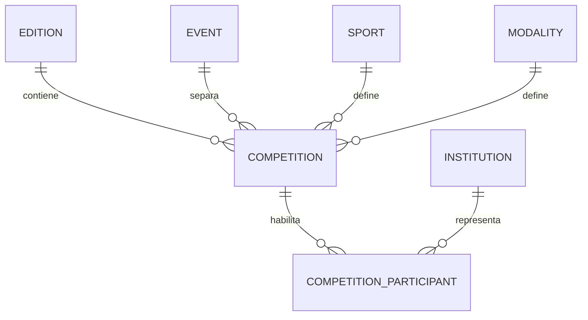
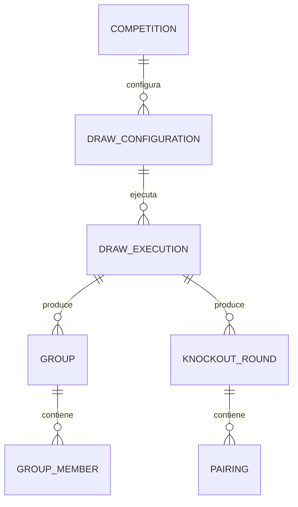
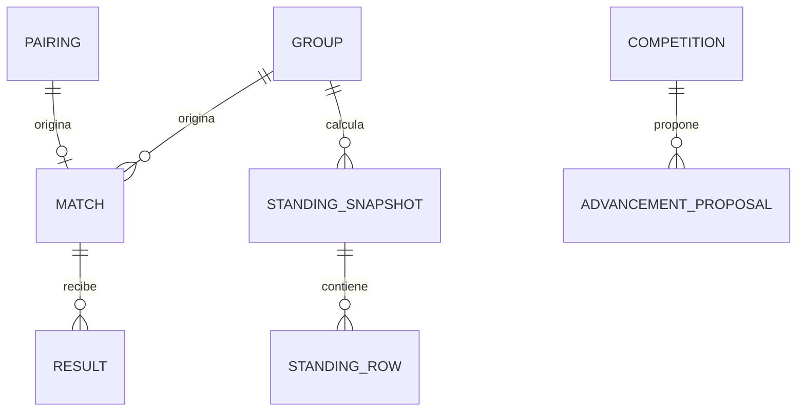

# Modelo de datos — Sistema Web de Competencias OES

> **Estado:** Borrador técnico 0.1.0
> **Fecha:** 6 de agosto de 2026
> **Deriva de:** `FOUNDATION.md` 2.0.0 y `docs/01-domain-model.md` a `docs/05-architecture.md`
> **Autoridad:** Modelo relacional, integridad y persistencia
> **Siguiente documento:** `docs/07-api-contracts.md`

## 1. Propósito

Este documento define el modelo relacional que PostgreSQL debe implementar antes de crear el esquema Prisma. Establece tablas, claves, relaciones, estados, restricciones, índices, retención y fronteras transaccionales.

La base de datos no es un contenedor pasivo. Debe impedir inconsistencias estructurales incluso si una ruta de aplicación contiene un defecto o recibe dos comandos concurrentes.

## 2. Alcance

Incluye datos de:

- identidad, roles y sesiones;
- ediciones, eventos, instituciones, deportes y modalidades;
- competencias y participantes;
- plantillas competitivas;
- configuraciones y sorteos;
- grupos, rondas, cruces y pases libres;
- encuentros y resultados;
- tablas y propuestas de avance;
- publicaciones, evidencia y actas;
- auditoría, idempotencia y outbox.

Excluye deportistas, planteles, horarios, sedes, árbitros, sanciones, pagos y estadísticas individuales.

## 3. Convenciones físicas

| Concepto | Convención |
| --- | --- |
| Identificador | `uuid` opaco generado en servidor |
| Fecha e instante | `timestamptz` en UTC |
| Revisión mutable | `integer NOT NULL DEFAULT 1` |
| Estado | `text` con `CHECK` explícito |
| Código humano | `text` normalizado y único dentro de su alcance |
| Hash SHA-256 | `char(64)` hexadecimal minúsculo |
| Datos binarios sensibles | `bytea` cifrado cuando corresponda |
| Estructura flexible versionada | `jsonb` con versión de esquema y validación de aplicación |
| Texto libre | longitud limitada y normalización definida |

Se prefieren estados como `text + CHECK` frente a enums nativos de PostgreSQL para permitir migraciones controladas sin bloquear el ciclo de despliegue. El dominio conserva un tipo cerrado equivalente.

## 4. Columnas comunes

Las entidades mutables contienen, salvo justificación documentada:

```text
id           uuid primary key
revision     integer not null default 1 check (revision > 0)
created_at   timestamptz not null
created_by   uuid null references users(id)
updated_at   timestamptz not null
updated_by   uuid null references users(id)
```

Los hechos anexables usan `occurred_at` y no exponen columnas de actualización. Los instantes provienen del servidor o de PostgreSQL, nunca del reloj del navegador.

## 5. Política de eliminación

1. No existe borrado en cascada de datos competitivos.
2. Un registro oficial se anula, reemplaza o desactiva; no se elimina.
3. Catálogos referenciados usan `active` o estado equivalente.
4. Borradores sin dependencias pueden eliminarse mediante operación administrativa explícita antes del uso oficial.
5. Claves foráneas críticas usan `ON DELETE RESTRICT`.
6. Auditoría, resultados confirmados, sorteos oficiales y publicaciones no admiten borrado normal.

## 6. Vista general







## 7. Identidad y acceso

### 7.1 `users`

| Columna | Tipo | Regla |
| --- | --- | --- |
| `id` | uuid | PK |
| `email_normalized` | text | Único, no vacío |
| `display_name` | text | 1–120 caracteres |
| `password_hash` | text | Nunca se expone |
| `status` | text | `ACTIVE`, `DISABLED`, `LOCKED` |
| `credential_version` | integer | Invalida sesiones antiguas |
| `last_login_at` | timestamptz | Nullable |
| `created_at`, `updated_at` | timestamptz | Obligatorios |

Índice único sobre `lower(email_normalized)`. La normalización ocurre antes de persistir y se vuelve a verificar en servidor.

### 7.2 `user_roles`

| Columna | Tipo | Regla |
| --- | --- | --- |
| `user_id` | uuid | FK `users` |
| `role_code` | text | `SUPER_ADMIN`, `ADMIN`, `OPERATOR` |
| `granted_at` | timestamptz | Obligatorio |
| `granted_by` | uuid | FK `users` |

PK compuesta `(user_id, role_code)`. El rol público no se almacena; representa ausencia de sesión administrativa.

### 7.3 `sessions`

| Columna | Tipo | Regla |
| --- | --- | --- |
| `id` | uuid | PK interna |
| `token_hash` | char(64) | Único; nunca se almacena el token plano |
| `user_id` | uuid | FK `users` |
| `credential_version` | integer | Copia verificada contra usuario |
| `created_at`, `expires_at` | timestamptz | Obligatorios |
| `last_seen_at` | timestamptz | Obligatorio |
| `revoked_at` | timestamptz | Nullable |
| `revoked_reason` | text | Requerido si está revocada |

Índices por `(user_id, revoked_at)` y `expires_at` para revocación y limpieza.

## 8. Catálogo competitivo

### 8.1 `editions`

- `id` uuid PK;
- `year` integer único y razonable;
- `name` text;
- `status` en `DRAFT`, `OPEN`, `CLOSED`;
- columnas comunes.

### 8.2 `events`

- `id` uuid PK;
- `code` único: inicialmente `COLEGIALES`, `UNIVERSITARIOS`;
- `name` text;
- `active` boolean.

### 8.3 `institutions`

- `id` uuid PK;
- `event_id` uuid FK `events`;
- `code` text;
- `name` text;
- `normalized_name` text;
- `active` boolean;
- columnas comunes.

Restricciones únicas `(event_id, code)` y `(event_id, normalized_name)`. La pertenencia al evento es obligatoria y no cambia después de participar oficialmente.

Además expone `UNIQUE (event_id, id)` para sostener la FK compuesta de participantes.

### 8.4 `sports`

- `id` uuid PK;
- `code` text único;
- `name` text;
- `active` boolean.

### 8.5 `modalities`

- `id` uuid PK;
- `code` text único: inicialmente `MALE`, `FEMALE`;
- `name` text;
- `active` boolean.

### 8.6 `event_sport_modalities`

Define combinaciones autorizadas:

```text
event_id     uuid references events
sport_id     uuid references sports
modality_id  uuid references modalities
active       boolean not null
primary key (event_id, sport_id, modality_id)
```

Una competencia solo puede referenciar una combinación activa al crearse.

## 9. Competencias

### 9.1 `competitions`

| Columna | Tipo | Regla |
| --- | --- | --- |
| `id` | uuid | PK |
| `edition_id` | uuid | FK `editions` |
| `event_id` | uuid | Parte de la frontera |
| `sport_id` | uuid | Parte de la identidad |
| `modality_id` | uuid | Parte de la identidad |
| `status` | text | `DRAFT`, `OPEN`, `LOCKED`, `FINALIZED` |
| `format_code` | text | `GROUP_STAGE`, `KNOCKOUT` o null antes de configurar |
| `locked_at`, `finalized_at` | timestamptz | Condicionados por estado |
| `locked_by`, `finalized_by` | uuid | FK `users` |
| `revision` | integer | Concurrencia optimista |

Restricciones:

- única `(edition_id, event_id, sport_id, modality_id)`;
- FK compuesta `(event_id, sport_id, modality_id)` a combinaciones autorizadas;
- `locked_at/locked_by` obligatorios desde `LOCKED`;
- `finalized_at/finalized_by` obligatorios en `FINALIZED`;
- índice `(edition_id, event_id, status)`.

### 9.2 Frontera redundante deliberada

`competitions` expone además `UNIQUE (event_id, id)`. Las tablas que vinculan competencia e institución repiten `event_id` para que PostgreSQL pueda impedir mezclas mediante claves foráneas compuestas.

## 10. Participantes

### 10.1 `competition_participants`

| Columna | Tipo | Regla |
| --- | --- | --- |
| `id` | uuid | PK |
| `competition_id` | uuid | FK compuesta con evento |
| `event_id` | uuid | Debe coincidir con ambos extremos |
| `institution_id` | uuid | FK compuesta con evento |
| `display_name` | text | Nombre usado en la competencia |
| `status` | text | `ENABLED`, `WITHDRAWN` |
| `enabled_at`, `enabled_by` | — | Evidencia |
| `revision` | integer | Concurrencia |

Restricciones:

- FK `(event_id, competition_id)` a `competitions(event_id, id)`;
- FK `(event_id, institution_id)` a `institutions(event_id, id)`;
- única `(competition_id, institution_id)`;
- única `(competition_id, id)` para referencias compuestas posteriores;
- no puede retirarse después del bloqueo salvo procedimiento formal fuera del flujo normal.

Esta estructura vuelve imposible insertar una institución universitaria en una competencia colegial sin violar una FK.

## 11. Plantillas competitivas

### 11.1 `competition_rule_sets`

| Columna | Tipo | Regla |
| --- | --- | --- |
| `id` | uuid | PK |
| `competition_id` | uuid | FK |
| `schema_version` | integer | Mayor que cero |
| `revision_number` | integer | Secuencia dentro de competencia |
| `result_profile` | text | `SCORE_BASED`, `SET_BASED` |
| `profile_config` | jsonb | Configuración versionada del perfil |
| `knockout_resolution_code` | text | Política soportada |
| `status` | text | `DRAFT`, `FROZEN`, `REPLACED` |
| `canonical_hash` | char(64) | Obligatorio al congelar |
| `frozen_at`, `frozen_by` | — | Obligatorios en `FROZEN` |

Única `(competition_id, revision_number)` y como máximo una plantilla `FROZEN` vigente por competencia mediante índice único parcial.

La tabla expone también `UNIQUE (competition_id, id)` para impedir que una configuración vincule una plantilla de otra competencia.

### 11.2 `rule_set_outcomes`

- `rule_set_id` FK;
- `outcome_code` text;
- `table_points` integer;
- `description` text;
- PK `(rule_set_id, outcome_code)`.

### 11.3 `rule_set_metrics`

- `rule_set_id` FK;
- `metric_code` text;
- `enabled` boolean;
- PK `(rule_set_id, metric_code)`.

### 11.4 `rule_set_tiebreaks`

- `rule_set_id` FK;
- `position` integer mayor que cero;
- `criterion_code` text de lista permitida;
- `config` jsonb nullable;
- PK `(rule_set_id, position)`;
- única `(rule_set_id, criterion_code)` salvo criterio expresamente repetible en una versión futura.

Las filas hijas de una plantilla congelada no se modifican. La aplicación y un trigger de protección rechazan `UPDATE` o `DELETE`.

## 12. Configuraciones de sorteo

### 12.1 `draw_configurations`

| Columna | Tipo | Regla |
| --- | --- | --- |
| `id` | uuid | PK |
| `competition_id` | uuid | FK |
| `rule_set_id` | uuid | Plantilla congelada de la misma competencia |
| `round_number` | integer | Cero para grupos; positivo en eliminación |
| `format_code` | text | `GROUP_STAGE`, `KNOCKOUT` |
| `group_count` | integer | Solo grupos |
| `participant_count` | integer | Instantánea |
| `algorithm_version` | text | Inicialmente `oes-draw-v1` |
| `status` | text | `DRAFT`, `FROZEN`, `DISCARDED` |
| `configuration_hash` | char(64) | Obligatorio al congelar |
| `revision` | integer | Concurrencia |

Restricciones de forma:

- grupos: `round_number = 0`, `group_count > 0` y `3G ≤ N ≤ 4G`;
- eliminación: `round_number > 0` y `group_count IS NULL`;
- única configuración congelada vigente por `(competition_id, round_number)`;
- `rule_set_id` debe pertenecer a la misma competencia mediante FK compuesta.
- la tabla expone `UNIQUE (competition_id, id)` para sus instantáneas de participantes.

### 12.2 `draw_configuration_participants`

Conserva la entrada exacta:

- `draw_configuration_id` uuid FK;
- `competition_id` uuid;
- `competition_participant_id` uuid;
- `canonical_order` integer;
- `display_name_snapshot` text;
- `bye_count_snapshot` integer no negativo;
- PK `(draw_configuration_id, competition_participant_id)`;
- única `(draw_configuration_id, canonical_order)`.

Una FK compuesta garantiza que el participante pertenece a la competencia de la configuración.

En concreto, `(competition_id, draw_configuration_id)` referencia a la configuración y `(competition_id, competition_participant_id)` al participante habilitado.

## 13. Ejecuciones de sorteo

### 13.1 `draw_executions`

| Columna | Tipo | Regla |
| --- | --- | --- |
| `id` | uuid | PK |
| `draw_configuration_id` | uuid | FK |
| `execution_kind` | text | `SIMULATION`, `OFFICIAL` |
| `status` | text | `EXECUTED`, `CONFIRMED`, `PUBLISHED`, `ANNULLED` |
| `algorithm_version` | text | Copia inmutable |
| `configuration_hash` | char(64) | Copia inmutable |
| `seed_commitment` | char(64) | Oficial |
| `seed_ciphertext` | bytea | Nunca al navegador antes de revelar |
| `revealed_seed` | bytea | Nullable |
| `result_hash` | char(64) | Obligatorio después de ejecutar |
| `evidence_payload` | jsonb | Carga canónica versionada |
| `executed_at`, `executed_by` | — | Obligatorios |
| `confirmed_at`, `confirmed_by` | — | Condicionados |
| `annulled_at`, `annulled_by`, `annulment_reason` | — | Condicionados |
| `replaces_draw_id` | uuid | FK nullable |
| `revision` | integer | Concurrencia |

Restricciones:

- `confirmed_by <> executed_by`;
- campos de confirmación obligatorios desde `CONFIRMED`;
- campos de anulación y motivo no vacío obligatorios en `ANNULLED`;
- una sola ejecución `OFFICIAL` no anulada por configuración mediante índice único parcial;
- simulaciones nunca son origen de grupos, rondas ni publicaciones.

## 14. Fase de grupos

### 14.1 `groups`

- `id` uuid PK;
- `draw_execution_id` uuid FK a sorteo oficial confirmado;
- `competition_id` uuid FK;
- `label` text;
- `ordinal` integer mayor que cero;
- `expected_size` integer entre 3 y 4;
- única `(draw_execution_id, ordinal)`;
- única `(draw_execution_id, label)`;
- única `(competition_id, id)`.
- única `(draw_execution_id, competition_id, id)` para miembros de grupo.

### 14.2 `group_members`

- `group_id` uuid;
- `draw_execution_id` uuid;
- `competition_id` uuid;
- `competition_participant_id` uuid;
- `position_in_draw` integer;
- PK `(group_id, competition_participant_id)`;
- única `(group_id, position_in_draw)`;
- única `(draw_execution_id, competition_participant_id)`;
- FK compuesta vincula `(draw_execution_id, competition_id, group_id)` con el grupo de origen.

La confirmación valida que cada grupo tenga su tamaño esperado y que cada participante de la configuración aparezca exactamente una vez.

## 15. Eliminación directa

### 15.1 `knockout_rounds`

- `id` uuid PK;
- `competition_id` uuid FK;
- `draw_execution_id` uuid FK a oficial confirmado;
- `round_number` integer mayor que cero;
- `status` en `DRAWN`, `IN_PROGRESS`, `PENDING_ADVANCEMENT`, `CLOSED`, `ANNULLED`;
- única `(competition_id, round_number)` para ronda vigente;
- única `(draw_execution_id)`;
- única `(competition_id, id)`.

### 15.2 `pairings`

- `id` uuid PK;
- `competition_id`, `round_id` FK compuesta;
- `ordinal` integer mayor que cero;
- `participant_a_id` uuid;
- `participant_b_id` uuid;
- `status` en `CONFIRMED`, `ANNULLED`;
- única `(round_id, ordinal)`;
- única `(competition_id, id)`;
- `participant_a_id <> participant_b_id`;
- FKs compuestas garantizan participantes de la competencia.

Un trigger de restricción diferido inspecciona ambas columnas y rechaza que un participante aparezca en más de un cruce de la misma ronda o simultáneamente como pase libre.

### 15.3 `round_byes`

- `id` uuid PK;
- `competition_id`, `round_id` FK compuesta;
- `participant_id` uuid;
- `prior_bye_count` integer no negativo;
- `assigned_at` timestamptz;
- única `(round_id)`;
- única `(round_id, participant_id)`.

El pase libre no crea emparejamiento incompleto ni encuentro artificial. Su historial se deriva de `round_byes` confirmados, no de un contador editable en participante.

## 16. Encuentros

### 16.1 `matches`

| Columna | Tipo | Regla |
| --- | --- | --- |
| `id` | uuid | PK |
| `competition_id` | uuid | Frontera |
| `origin_type` | text | `GROUP`, `PAIRING` |
| `group_id` | uuid | Solo origen grupo |
| `pairing_id` | uuid | Solo origen cruce |
| `sequence` | integer | Orden lógico |
| `participant_a_id`, `participant_b_id` | uuid | Distintos y de la competencia |
| `canonical_participant_1_id`, `canonical_participant_2_id` | uuid | Par ordenado para unicidad |
| `status` | text | `LOGICAL_SCHEDULED`, `AWAITING_RESULT`, `RESULT_PENDING`, `RESULT_CONFIRMED`, `CLOSED` |
| `revision` | integer | Concurrencia |

Restricciones:

- XOR: exactamente uno de `group_id`, `pairing_id` es no nulo;
- `origin_type` coincide con la FK presente;
- participantes distintos;
- par canónico ordenado y equivalente al par A/B;
- única parcial `(group_id, canonical_participant_1_id, canonical_participant_2_id)`;
- única parcial `(pairing_id)`;
- única `(group_id, sequence)` para grupos;
- la tabla expone `UNIQUE (competition_id, id)` para resultados;
- FKs `(competition_id, group_id)` y `(competition_id, pairing_id)` impiden orígenes de otra competencia;
- no existen columnas de fecha, hora, sede, cancha o árbitro en esta versión.

## 17. Resultados

### 17.1 `results`

| Columna | Tipo | Regla |
| --- | --- | --- |
| `id` | uuid | PK |
| `match_id`, `competition_id` | uuid | FK compuesta |
| `rule_set_id` | uuid | Plantilla usada |
| `revision_number` | integer | Secuencia dentro del encuentro |
| `profile_code` | text | Copia del perfil |
| `score_a`, `score_b` | integer | Solo `SCORE_BASED`, no negativos |
| `derived_outcome_a`, `derived_outcome_b` | text | Solo tras confirmar |
| `derived_winner_id` | uuid | Obligatorio en eliminación confirmada |
| `status` | text | `PENDING_CONFIRMATION`, `CONFIRMED`, `ANNULLED`, `SUPERSEDED` |
| `submitted_at`, `submitted_by` | — | Obligatorios |
| `confirmed_at`, `confirmed_by` | — | Condicionados |
| `annulled_at`, `annulled_by`, `annulment_reason` | — | Condicionados |
| `supersedes_result_id` | uuid | FK nullable |
| `payload_hash` | char(64) | Integridad de revisión |

Restricciones:

- única `(match_id, revision_number)`;
- máximo un resultado `PENDING_CONFIRMATION` por encuentro;
- máximo un resultado `CONFIRMED` vigente por encuentro mediante índices parciales;
- `confirmed_by <> submitted_by`;
- resultado confirmado exige campos derivados;
- `SCORE_BASED` exige marcadores no negativos y no admite filas en `result_sets`;
- `SET_BASED` exige marcadores simples nulos y al menos un set válido antes de confirmar;
- `rule_set_id` y `derived_winner_id`, cuando exista, pertenecen a la misma competencia mediante FKs compuestas;
- anulado exige superadministrador validado por aplicación, actor, instante y motivo;
- resultado reemplazante referencia la revisión anterior.

### 17.2 `result_sets`

Para `SET_BASED`:

- `result_id` uuid FK;
- `set_number` integer mayor que cero;
- `points_a`, `points_b` integer no negativos;
- `winner_participant_id` uuid derivado;
- PK `(result_id, set_number)`;
- `points_a <> points_b` cuando la plantilla no permite empate de set.

Un trigger de protección impide modificar sets de un resultado confirmado.

## 18. Tablas de posiciones

### 18.1 `standing_snapshots`

- `id` uuid PK;
- `group_id`, `competition_id` FK compuesta;
- `rule_set_id` uuid;
- `calculation_number` integer;
- `status` en `PARTIAL`, `RANKED`, `TIE_UNRESOLVED`, `INVALIDATED`;
- `source_hash` char(64);
- `calculated_at` timestamptz;
- `calculated_by_type` text igual a `SYSTEM`;
- `invalidated_at`, `invalidation_reason` nullable;
- única `(group_id, calculation_number)`;
- máximo una instantánea vigente por grupo.

### 18.2 `standing_source_results`

- `standing_snapshot_id` uuid;
- `result_id` uuid;
- PK `(standing_snapshot_id, result_id)`.

### 18.3 `standing_rows`

| Columna | Tipo |
| --- | --- |
| `standing_snapshot_id` | uuid |
| `competition_participant_id` | uuid |
| `rank` | integer nullable si no está resuelto |
| `played`, `won`, `drawn`, `lost` | integer no negativo |
| `table_points` | integer |
| `score_for`, `score_against`, `score_difference` | integer nullable |
| `sets_won`, `sets_lost`, `set_difference` | integer nullable |
| `sport_points_for`, `sport_points_against`, `sport_point_difference` | integer nullable |
| `tiebreak_trace` | jsonb |

PK `(standing_snapshot_id, competition_participant_id)` y única parcial `(standing_snapshot_id, rank)` cuando `rank` no es nulo.

No existen comandos ni permisos para actualizar filas. Una nueva fuente produce otra instantánea.

## 19. Propuestas de avance

### 19.1 `advancement_proposals`

| Columna | Tipo | Regla |
| --- | --- | --- |
| `id` | uuid | PK |
| `competition_id` | uuid | FK |
| `proposal_type` | text | `GROUP_QUALIFIERS`, `ROUND_WINNERS`, `FINAL_WINNER` |
| `group_id` | uuid | Solo clasificación de grupo |
| `round_id` | uuid | Solo ganadores de ronda |
| `standing_snapshot_id` | uuid | Requerido para grupo |
| `source_hash` | char(64) | Evidencia de dependencias |
| `status` | text | `PENDING_CONFIRMATION`, `CONFIRMED`, `REJECTED`, `INVALIDATED`, `ANNULLED` |
| `calculated_at` | timestamptz | Sistema |
| `confirmed_at`, `confirmed_by` | — | Condicionados |
| `rejected_at`, `rejected_by`, `rejection_reason` | — | Condicionados |
| `invalidated_at`, `invalidation_reason` | — | Condicionados |
| `revision` | integer | Concurrencia |

XOR y checks vinculan el tipo con `group_id`, `round_id` o final. Solo una propuesta vigente por origen.

### 19.2 `advancement_entries`

- `proposal_id` uuid FK;
- `competition_participant_id` uuid;
- `source_kind` en `GROUP_RANK`, `MATCH_WINNER`, `BYE`, `FINAL`;
- `source_id` uuid;
- `position` integer mayor que cero;
- PK `(proposal_id, competition_participant_id)`;
- única `(proposal_id, position)`.

Una propuesta de grupo confirmable contiene exactamente posiciones 1 y 2. La aplicación y una función transaccional validan que `confirmed_by` no sea el registrador del último resultado ni otro actor incompatible.

## 20. Publicaciones

### 20.1 `publications`

- `id` uuid PK;
- `competition_id` uuid FK;
- `publication_type` en `DRAW`, `STANDINGS`, `ADVANCEMENT`, `FINAL`;
- `source_type`, `source_id`;
- `source_revision` integer;
- `status` en `PUBLISHED`, `REPLACED`, `ANNULLED`;
- `public_code_hash` char(64) único;
- `public_code_prefix` text indexable;
- `canonical_payload` jsonb;
- `payload_hash` char(64);
- `published_at`, `published_by`;
- `replaced_by_publication_id` uuid nullable;
- `annulled_at`, `annulled_by`, `annulment_reason` nullable.

El código plano solo se entrega al crear la publicación; se persiste su hash. El prefijo no permite adivinar el código completo.

### 20.2 `publication_artifacts`

- `id` uuid PK;
- `publication_id` uuid FK;
- `artifact_type` en `ACT_PDF`;
- `storage_key` text nullable;
- `content_hash` char(64);
- `generated_at` timestamptz;
- `generator_version` text;
- `status` en `PENDING`, `AVAILABLE`, `FAILED`;
- `last_error_code` text nullable.

El artefacto es regenerable. La publicación y su carga canónica son la fuente de verdad.

## 21. Auditoría

### 21.1 `audit_entries`

| Columna | Tipo |
| --- | --- |
| `id` | uuid PK |
| `occurred_at` | timestamptz |
| `actor_id` | uuid nullable para sistema |
| `actor_role` | text |
| `action_code` | text |
| `resource_type`, `resource_id` | text, uuid |
| `competition_id` | uuid nullable |
| `revision_before`, `revision_after` | integer nullable |
| `correlation_id` | uuid |
| `reason` | text nullable |
| `metadata` | jsonb seguro |

Índices por `(competition_id, occurred_at DESC)`, `(resource_type, resource_id, occurred_at)` y `correlation_id`.

La cuenta de aplicación no recibe permisos `UPDATE` ni `DELETE` sobre esta tabla. Los secretos y credenciales nunca se copian a `metadata`.

## 22. Idempotencia

### 22.1 `idempotency_records`

- `id` uuid PK;
- `actor_id` uuid FK;
- `scope` text;
- `idempotency_key_hash` char(64);
- `request_hash` char(64);
- `status` en `PROCESSING`, `COMPLETED`, `FAILED_RETRYABLE`;
- `response_status` integer nullable;
- `response_body` jsonb nullable y limitado;
- `resource_type`, `resource_id` nullable;
- `created_at`, `completed_at`, `expires_at`;
- única `(actor_id, scope, idempotency_key_hash)`.

Una misma clave con otro `request_hash` produce `IDEMPOTENCY_CONFLICT`. Los registros de operaciones oficiales no se purgan antes del periodo operativo definido.

## 23. Outbox

### 23.1 `outbox_events`

- `id` uuid PK;
- `aggregate_type`, `aggregate_id`;
- `competition_id` uuid nullable;
- `event_type` text;
- `schema_version` integer;
- `payload` jsonb;
- `occurred_at` timestamptz;
- `available_at` timestamptz;
- `claimed_at`, `claimed_by` nullable;
- `processed_at` nullable;
- `attempt_count` integer no negativo;
- `last_error_code` text nullable;
- `status` en `PENDING`, `PROCESSING`, `PROCESSED`, `DEAD`.

Índice parcial `(available_at, occurred_at)` donde `status = 'PENDING'`. El worker reclama filas con `FOR UPDATE SKIP LOCKED` y procesa consumidores idempotentes.

## 24. Integridad que debe imponer PostgreSQL

| Invariante | Mecanismo |
| --- | --- |
| Competencia única | `UNIQUE` compuesto |
| No mezclar eventos | FK compuesta con `event_id` |
| Participante no duplicado | `UNIQUE (competition_id, institution_id)` |
| Plantilla congelada única | Índice único parcial |
| Sorteo oficial único | Índice único parcial |
| Auto-confirmación | `CHECK` específico: confirmador distinto de ejecutor o registrador |
| Grupo de 3–4 | `CHECK` y validación diferida al confirmar |
| Participante una vez por sorteo | Restricción/trigger diferido |
| Cruce sin repetidos | FKs, `CHECK` y unicidad por ronda |
| Pase libre máximo uno | `UNIQUE (round_id)` |
| Encuentro por par | Índice único parcial con par canónico |
| Encuentro por cruce | Índice único parcial sobre `pairing_id` |
| Resultado vigente único | Índice único parcial |
| Resultado inmutable confirmado | Trigger de protección y permisos |
| Tabla no editable | Sin comando, permisos restringidos e instantáneas |
| Auditoría anexable | Permisos SQL restringidos |

## 25. Integridad transaccional de aplicación

Algunas reglas cruzan varias filas o necesitan identidad y permisos actuales. Se validan en una función transaccional o manejador con bloqueo adecuado:

- rol efectivo para anular;
- confirmador compatible con el último registrador;
- lista completa y exacta de miembros de grupos;
- elegibilidad mínima para pase libre;
- coherencia entre evidencia y resultado de sorteo;
- correspondencia entre resultado y plantilla;
- cálculo completo de tabla;
- exactamente dos clasificados por grupo;
- invalidación de dependencias tras anular;
- transición legal entre estados.

La aplicación no puede usar esta lista como excusa para omitir restricciones que sí son expresables en PostgreSQL.

## 26. Índices de consulta

Índices iniciales mínimos:

- `competitions (edition_id, event_id, status)`;
- `competition_participants (competition_id, status)`;
- `draw_configurations (competition_id, round_number, status)`;
- `draw_executions (draw_configuration_id, status)`;
- `groups (competition_id, ordinal)`;
- `knockout_rounds (competition_id, round_number)`;
- `matches (competition_id, status)`;
- `matches (group_id, sequence)`;
- `results (match_id, status, revision_number DESC)`;
- `standing_snapshots (group_id, calculated_at DESC)`;
- `advancement_proposals (competition_id, status)`;
- `publications (competition_id, publication_type, status)`;
- auditoría, sesiones, idempotencia y outbox según sus secciones.

No se añaden índices por intuición masiva. Cada índice adicional requiere una consulta real, plan de ejecución o restricción que lo justifique.

## 27. JSONB permitido

JSONB se limita a:

- configuración versionada de perfiles deportivos;
- configuración específica de desempate;
- evidencia canónica;
- traza explicativa de criterios;
- payload de outbox;
- metadatos seguros de auditoría;
- respuesta idempotente acotada.

No se usa JSONB para participantes, grupos, encuentros, resultados fuente, filas de tabla, roles ni relaciones que requieran claves foráneas.

Todo JSONB normativo incluye `schemaVersion` y se valida antes de persistir. Al congelarse o publicarse se canoniza y obtiene hash.

## 28. Reglas de concurrencia

1. Toda actualización mutable usa `WHERE id = ? AND revision = ?`.
2. Una actualización exitosa incrementa `revision` exactamente en uno.
3. Cero filas afectadas produce `CONCURRENCY_CONFLICT`.
4. Confirmaciones críticas bloquean la fila raíz durante la transacción.
5. Índices únicos resuelven carreras de creación.
6. Los conflictos de unicidad se traducen a errores normativos, no a mensajes SQL.
7. La segunda confirmación concurrente nunca sobrescribe la primera.

## 29. Inmutabilidad y reemplazo

Los registros confirmados no se editan:

- sorteo: `ANNULLED` y nueva ejecución con `replaces_draw_id`;
- resultado: `ANNULLED` y nueva revisión con `supersedes_result_id`;
- tabla: `INVALIDATED` y nueva instantánea;
- propuesta: `INVALIDATED` o `ANNULLED` y nueva propuesta;
- publicación: `REPLACED` o `ANNULLED` y nueva publicación.

Las relaciones de reemplazo no forman ciclos. Una restricción de aplicación y prueba de integridad verifica la cadena.

## 30. Restauración del estado

El estado de una competencia se reconstruye en este orden:

1. competencia, catálogo y participantes;
2. plantilla congelada;
3. configuraciones y sorteos;
4. grupos, rondas, cruces y pases;
5. encuentros;
6. resultados confirmados vigentes;
7. tablas vigentes o recálculo;
8. propuestas y avances;
9. publicaciones;
10. outbox pendiente.

Si una proyección contradice sus fuentes, se invalida y recalcula. Si un hecho autoritativo es incoherente, el sistema falla cerrado con `RESTORATION_INTEGRITY_FAILURE`; no inventa un estado para continuar.

## 31. Copias y retención

- backup completo periódico de PostgreSQL;
- recuperación a punto en el tiempo cuando el proveedor lo permita;
- retención que cubra toda la edición y el periodo administrativo posterior;
- copias de artefactos externos o capacidad probada de regeneración;
- restauración ensayada antes del primer sorteo oficial;
- verificación de conteos, FKs, hashes y una competencia completa tras restaurar.

La política exacta de días y frecuencia se define con el entorno de producción. No se promete recuperación sin haberla probado.

## 32. Migraciones

1. Toda modificación del esquema se versiona en Git.
2. Producción no usa `db push` ni sincronización destructiva.
3. Las migraciones incluyen SQL manual para checks, índices parciales, triggers y permisos que Prisma no exprese.
4. Un cambio incompatible sigue estrategia expandir–migrar–contraer.
5. La aplicación nueva no se despliega antes de que el esquema compatible exista.
6. No se elimina una columna con datos oficiales en el mismo despliegue que deja de usarla.
7. Cada migración tiene prueba sobre una copia representativa anonimizada.

## 33. Permisos de base de datos

Se separan identidades técnicas:

- `migration_role`: altera esquema durante despliegue controlado;
- `app_role`: CRUD limitado a tablas operativas y ejecución permitida;
- `worker_role`: lectura de outbox y escritura de efectos específicos;
- `readonly_role`: observabilidad o soporte autorizado sin mutación.

`app_role` no puede eliminar auditoría ni hechos oficiales. Ninguna aplicación usa la cuenta propietaria de PostgreSQL.

## 34. Datos iniciales

El seed operativo crea únicamente:

- eventos `COLEGIALES` y `UNIVERSITARIOS`;
- modalidades `MALE` y `FEMALE`;
- deportes iniciales autorizados;
- combinaciones evento–deporte–modalidad permitidas;
- primer superadministrador mediante procedimiento seguro separado.

No crea competencias, participantes, sorteos ni resultados ficticios en producción.

Los datos de demostración viven en seeds exclusivos de desarrollo y prueba.

## 35. Pruebas del modelo

### Restricciones

- rechazar competencia duplicada;
- rechazar institución de otro evento;
- rechazar participante duplicado;
- rechazar dos plantillas congeladas;
- rechazar dos sorteos oficiales vigentes;
- rechazar auto-confirmación;
- rechazar participante repetido en grupos o ronda;
- rechazar encuentro duplicado;
- rechazar dos resultados vigentes;
- rechazar actualización de resultado confirmado;
- rechazar anulación sin motivo.

### Transacciones

- confirmar sorteo genera todos los encuentros o ninguno;
- confirmar resultado actualiza resultado, tabla y propuesta o nada;
- anular resultado invalida dependencias y recalcula de forma coherente;
- dos confirmaciones concurrentes producen un éxito y un conflicto;
- reintento idempotente devuelve el mismo recurso.

### Restauración

- reconstruir grupo de tres y cuatro;
- reconstruir ronda con pase libre;
- reconstruir tabla desde resultados;
- detectar fuente faltante o hash divergente;
- continuar outbox después de reinicio.

## 36. Decisiones diferidas

Este documento no fija todavía:

- nombres finales de endpoints;
- DTO públicos;
- campos exactos de cada perfil JSON;
- proveedor de PostgreSQL;
- frecuencia contractual de backups;
- diseño de pantallas;
- almacenamiento externo concreto para PDFs.

Sí fija las garantías que esas decisiones deben preservar.

## 37. Gate del modelo de datos

El modelo se considera aprobable cuando:

1. Toda entidad de Foundation tiene representación o derivación explícita.
2. Colegiales y Universitarios no pueden mezclarse por FK.
3. La combinación de competencia es única.
4. Participantes, grupos, cruces y encuentros no pueden duplicarse.
5. Plantillas y configuraciones congeladas son inmutables.
6. Sorteos y resultados aplican doble control.
7. Solo existe un hecho oficial vigente por origen.
8. Los pases libres no crean encuentros artificiales.
9. Los puntos y posiciones no admiten edición directa.
10. Las proyecciones declaran sus resultados fuente.
11. Anulaciones y reemplazos preservan historia.
12. Auditoría, idempotencia y outbox son persistentes.
13. Las operaciones críticas tienen una frontera transaccional viable.
14. Las consultas principales poseen índices iniciales.
15. Las migraciones pueden expresar checks e índices parciales fuera de Prisma.
16. El estado completo puede restaurarse sin repetir operaciones.

Si Prisma no puede representar una restricción necesaria, se conserva mediante SQL de migración; no se elimina la restricción para acomodar la herramienta.
