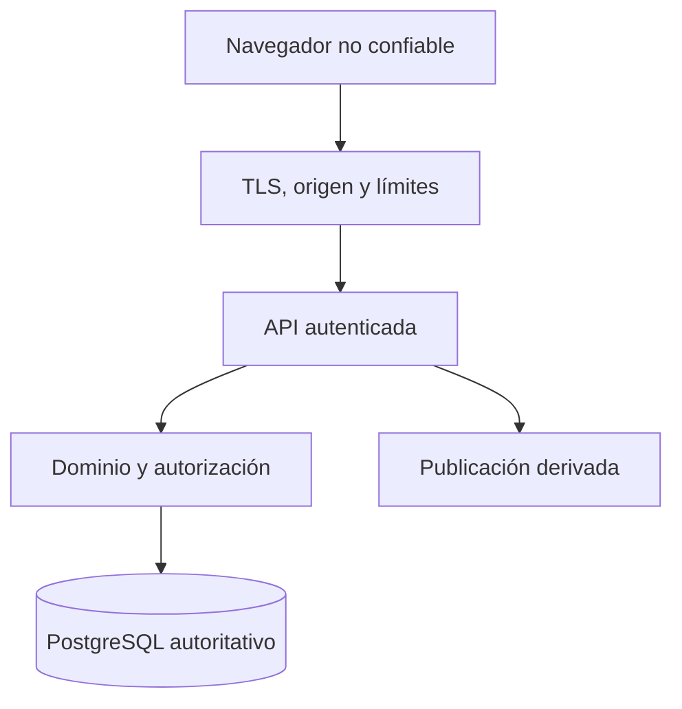

# Seguridad y auditoría — Sistema Web de Competencias OES

> **Estado:** Borrador técnico 0.1.0
> **Fecha:** 6 de agosto de 2026
> **Deriva de:** `FOUNDATION.md` 2.0.0 y `docs/01-domain-model.md` a `docs/06-data-model.md`
> **Autoridad:** Controles de seguridad, permisos, amenazas y trazabilidad
> **Siguiente documento:** `docs/08-ui-flows.md`

## 1. Propósito

Este documento define cómo proteger la autoridad competitiva, las credenciales, la evidencia, la base de datos y la publicación pública del Sistema Web de Competencias OES.

La seguridad no se reduce a iniciar sesión. El sistema debe impedir que una cuenta, un navegador manipulado, un reintento, una carrera concurrente o una operación interna conviertan un dato no confirmado en estado oficial.

## 2. Objetivos de seguridad

1. Solo identidades autorizadas ejecutan operaciones administrativas.
2. Ninguna identidad confirma una operación crítica propia.
3. Solo el superadministrador anula hechos oficiales.
4. El navegador no decide permisos, sorteos, puntos, posiciones ni avances.
5. Los secretos de sesión y sorteo no se exponen.
6. Toda operación crítica queda atribuida y trazable.
7. Los registros oficiales no se modifican sin anulación y reemplazo.
8. Colegiales y Universitarios permanecen aislados.
9. La evidencia pública permite detectar alteraciones.
10. Una copia restaurada conserva autoridad e integridad.

## 3. Activos protegidos

| Activo | Riesgo principal | Nivel |
| --- | --- | --- |
| Cuentas administrativas | Suplantación o abuso de permisos | Crítico |
| Sesiones activas | Robo y reutilización | Crítico |
| Semillas privadas | Predicción o manipulación del sorteo | Crítico |
| Sorteos confirmados | Alteración o sustitución | Crítico |
| Resultados confirmados | Cambio de ganador o tabla | Crítico |
| Plantillas congeladas | Cambio de puntajes o desempates | Crítico |
| Avances confirmados | Clasificación ilegítima | Crítico |
| Auditoría | Borrado o encubrimiento | Alto |
| Base de datos y backups | Pérdida, filtración o corrupción | Alto |
| Publicaciones y actas | Desinformación pública | Alto |
| Datos de cuentas | Exposición de información personal | Alto |
| Disponibilidad del sistema | Interrupción operativa | Alto durante competencia |

## 4. Actores de amenaza

El diseño considera:

- persona pública sin autenticación que automatiza o manipula solicitudes;
- usuario autenticado que intenta exceder su rol;
- administrador que intenta confirmar su propia acción;
- cuenta legítima comprometida;
- operador que intenta obtener capacidad de escritura;
- cliente web alterado o extensión maliciosa;
- atacante con acceso a logs, backups o variables de entorno;
- error humano de una autoridad;
- fallo concurrente o reintento interpretado como nueva operación;
- dependencia o artefacto de despliegue comprometido.

No se presume que el navegador, la red local del evento ni una cuenta autenticada sean confiables por sí mismos.

## 5. Fronteras de confianza

Cada frontera vuelve a validar lo necesario. Haber superado la UI, un proxy o un guard no elimina la validación en el caso de uso y en las restricciones de datos.

## 6. Modelo de roles

| Rol | Capacidad |
| --- | --- |
| `SUPER_ADMIN` | Administra cuentas y catálogo, opera competencias, confirma actos ajenos y anula con motivo |
| `ADMIN` | Configura competencias, ejecuta sorteos, registra resultados y confirma operaciones ajenas |
| `OPERATOR` | Consulta estado interno y opera vistas de presentación sin mutación competitiva |
| Público | Consulta únicamente contenido confirmado y publicado |

No existe registro público de cuentas ni rol implícito de escritura.

## 7. Matriz de permisos

| Acción | Público | Operador | Administrador | Superadministrador |
| --- | :---: | :---: | :---: | :---: |
| Consultar publicación | Sí | Sí | Sí | Sí |
| Consultar estado interno permitido | No | Sí | Sí | Sí |
| Operar presentación | No | Sí | Sí | Sí |
| Gestionar cuentas y roles | No | No | No | Sí |
| Configurar catálogo | No | No | No | Sí |
| Crear competencia | No | No | Sí | Sí |
| Gestionar participantes antes del bloqueo | No | No | Sí | Sí |
| Congelar reglas y competencia | No | No | Sí | Sí |
| Ejecutar sorteo | No | No | Sí | Sí |
| Confirmar sorteo ajeno | No | No | Sí | Sí |
| Registrar resultado | No | No | Sí | Sí |
| Confirmar resultado ajeno | No | No | Sí | Sí |
| Confirmar avance compatible | No | No | Sí | Sí |
| Publicar hecho confirmado | No | No | Sí | Sí |
| Anular hecho oficial | No | No | No | Sí |
| Consultar auditoría completa | No | No | Limitada | Sí |

La matriz expresa capacidad máxima. El estado, la competencia, la identidad iniciadora y la revisión pueden prohibir una acción incluso si el rol la permite.

## 8. Separación de funciones

Para sorteos y resultados:

- `confirmedBy` debe ser distinto de `executedBy` o `submittedBy`;
- la API obtiene ambas identidades desde sesiones y datos persistidos;
- el cliente no envía el actor efectivo;
- una cuenta con dos roles sigue siendo una sola identidad;
- el superadministrador tampoco confirma una acción propia;
- la segunda confirmación acepta la revisión exacta y no modifica el contenido.

Para avances, el confirmador debe ser compatible con las restricciones definidas y distinto del registrador del último resultado relevante.

La separación se valida en autorización, dominio, transacción y restricciones de datos aplicables.

## 9. Gobierno de cuentas

1. Solo un superadministrador crea, habilita, bloquea o deshabilita cuentas.
2. Cada persona usa una cuenta individual; quedan prohibidas las cuentas compartidas.
3. El nombre visible no sustituye al identificador interno.
4. Conceder o retirar un rol genera auditoría.
5. Deshabilitar una cuenta revoca todas sus sesiones.
6. Una cuenta no puede retirar el último superadministrador activo sin crear antes otro.
7. Los permisos se revisan antes de cada edición y al terminar el evento.
8. Cuentas temporales tienen fecha de expiración.

## 10. Autenticación

### 10.1 Contraseña

- mínimo de 12 caracteres;
- permite frases largas y gestores de contraseñas;
- no se trunca silenciosamente;
- se compara contra una lista de contraseñas comprometidas cuando el entorno lo permita;
- se almacena con un algoritmo resistente, sal única y parámetros versionados;
- no se exige rotación periódica sin indicio de compromiso;
- un cambio o recuperación incrementa `credentialVersion` y revoca sesiones.

### 10.2 Segundo factor

Antes de producción, MFA es obligatorio para superadministradores y administradores. Se aceptan TOTP o WebAuthn conforme a la capacidad implementada; SMS no es el mecanismo principal.

Los códigos de recuperación:

- son de un solo uso;
- se almacenan mediante hash;
- se muestran una sola vez;
- pueden regenerarse invalidando los anteriores;
- nunca se envían por logs ni analítica.

### 10.3 Inicio de sesión

- respuesta genérica ante usuario o contraseña incorrectos;
- límite por cuenta y origen;
- espera progresiva y bloqueo temporal, no permanente automático;
- registro de intentos relevantes sin guardar contraseña;
- alerta operativa ante patrones sostenidos.

## 11. Recuperación de cuenta

No existe recuperación pública automática en el MVP. El procedimiento administrativo:

1. verifica la identidad por un canal organizacional acordado;
2. requiere intervención de superadministrador;
3. genera credencial temporal de uso único o enlace breve;
4. obliga a establecer nueva contraseña y MFA;
5. revoca sesiones, códigos de recuperación y credenciales previas;
6. registra quién autorizó y ejecutó la recuperación.

Un superadministrador no puede recuperar silenciosamente su propia cuenta sin evidencia de otro responsable organizacional.

## 12. Sesiones

La sesión usa un token opaco aleatorio almacenado en cookie:

- `HttpOnly`;
- `Secure` en producción;
- `SameSite=Lax` o más restrictivo si los flujos lo permiten;
- alcance de dominio y ruta mínimos;
- token plano solo en el cliente; hash en base de datos;
- expiración absoluta y por inactividad;
- rotación al autenticar, elevar privilegios o cambiar credenciales;
- revocación individual y global.

La aplicación no guarda tokens administrativos en `localStorage` ni `sessionStorage`.

## 13. Protección CSRF y origen

Toda mutación autenticada por cookie exige:

- método no seguro correcto; no se muta mediante `GET`;
- verificación de `Origin` y, como respaldo, `Referer` cuando exista;
- token CSRF vinculado a sesión o patrón equivalente robusto;
- tipo de contenido esperado;
- política CORS cerrada al origen oficial;
- rechazo de solicitudes simples inesperadas.

Las rutas públicas de lectura no reciben credenciales administrativas innecesarias.

## 14. Autorización en servidor

El flujo obligatorio es:

1. autenticar sesión;
2. verificar estado de cuenta y versión de credencial;
3. resolver roles desde base de datos o caché breve invalidable;
4. cargar el recurso y su competencia;
5. verificar acción, rol, estado e identidad iniciadora;
6. aplicar dominio y revisión esperada;
7. persistir con restricciones y auditoría.

No se autoriza usando campos como `role`, `actorId`, `confirmedBy` o `competitionId` confiados desde el cuerpo cuando pueden derivarse del recurso y la sesión.

## 15. Control de concurrencia e idempotencia

Estos controles también son seguridad:

- `If-Match` o revisión esperada impide confirmar contenido obsoleto;
- `Idempotency-Key` evita que reintentos dupliquen actos;
- la clave se vincula a actor, alcance y hash de intención;
- una misma clave con otro contenido se rechaza;
- índices únicos cierran carreras de creación;
- confirmaciones críticas bloquean la raíz durante la transacción;
- los conflictos devuelven un código normativo, no detalles SQL.

Un timeout no se interpreta como fracaso definitivo: el cliente consulta el estado o reintenta con la misma clave.

## 16. Validación de entrada

Toda entrada se trata como no confiable:

- esquema runtime y rechazo de campos desconocidos en comandos críticos;
- límites de longitud, cantidad y profundidad;
- UUID, estados y códigos cerrados;
- enteros dentro de rango;
- marcadores no negativos;
- JSONB conforme a `schemaVersion`;
- normalización Unicode definida para nombres y códigos;
- observaciones como texto plano;
- archivos generados exclusivamente por el servidor.

TypeScript no reemplaza validación runtime.

## 17. Protección de salida

- React escapa texto por defecto;
- no se utiliza HTML aportado por usuarios;
- JSON serializa únicamente DTO permitidos;
- errores no revelan stack, SQL, rutas internas ni existencia de datos protegidos;
- CSV, PDF o texto descargable neutraliza contenido activo;
- cabeceras evitan interpretación de tipos incorrectos;
- datos administrativos no se mezclan con caché pública.

## 18. Cabeceras web

Producción aplica, como mínimo:

- Content Security Policy restrictiva;
- `Strict-Transport-Security` después de validar HTTPS;
- `X-Content-Type-Options: nosniff`;
- `Referrer-Policy` limitada;
- `Permissions-Policy` sin capacidades no usadas;
- protección contra framing mediante CSP `frame-ancestors`;
- cookies seguras;
- caché `no-store` en respuestas administrativas sensibles.

La CSP empieza en modo de reporte en staging y se endurece antes de producción.

## 19. Transporte y red

1. TLS es obligatorio en producción.
2. HTTP redirige a HTTPS sin servir contenido sensible.
3. PostgreSQL no se expone a Internet pública.
4. Solo API y worker acceden a la base con identidades separadas.
5. Paneles de administración de infraestructura requieren control de acceso independiente.
6. CORS no usa `*` con credenciales.
7. Los ambientes usan dominios, bases y secretos distintos.

## 20. Secretos de aplicación

Se consideran secretos:

- claves de sesión y cifrado;
- credenciales de base de datos;
- semillas privadas no reveladas;
- claves de almacenamiento;
- credenciales de despliegue;
- secretos MFA;
- tokens de integración futura.

Reglas:

- nunca se guardan en Git;
- se inyectan mediante gestor de secretos o entorno protegido;
- se rotan con procedimiento documentado;
- tienen dueño, alcance y ambiente;
- no aparecen en logs, errores, métricas ni snapshots de pruebas;
- producción no reutiliza secretos de staging.

## 21. Ciclo seguro de la semilla

1. El servidor obtiene aleatoriedad criptográficamente segura.
2. Calcula compromiso antes de producir el resultado oficial.
3. Guarda la semilla protegida y la configuración canónica.
4. Ejecuta `oes-draw-v1` en servidor.
5. Persiste resultado, hash y evidencia antes de responder éxito.
6. Mantiene la semilla privada durante la confirmación.
7. La revela únicamente después de confirmar conforme a la publicación.
8. El verificador reproduce el resultado con versión histórica.

La semilla privada no se envía para animación ni se incluye en trazas. Una anulación no borra compromiso ni evidencia.

## 22. Protección de resultados y tablas

- solo un resultado confirmado alimenta cálculos;
- no existe endpoint para establecer puntos o posiciones;
- confirmar usa la revisión exacta registrada;
- anular exige superadministrador, motivo y nueva transacción;
- las tablas declaran sus resultados fuente;
- una divergencia invalida la proyección y fuerza recálculo;
- una publicación no puede apuntar a un resultado pendiente;
- el canal en tiempo real solo anuncia revisiones ya persistidas.

## 23. Seguridad de publicaciones

La vista pública:

- expone únicamente campos aprobados;
- no devuelve correos, roles, sesiones, auditoría interna o secretos;
- usa códigos de verificación no predecibles;
- guarda hash del código, no el código plano;
- limita intentos de verificación automatizados;
- muestra estado vigente, reemplazado o anulado;
- asocia acta, carga canónica y SHA-256;
- no convierte una simulación en publicación oficial.

Los hashes demuestran integridad, no autenticidad por sí solos; la publicación oficial y su dominio aportan el contexto de autoridad.

## 24. Auditoría de dominio

Se auditan obligatoriamente:

- creación, bloqueo y finalización de competencia;
- altas y bajas de participantes;
- creación y congelamiento de plantilla;
- simulación relevante y sorteo oficial;
- confirmación, publicación y anulación de sorteo;
- registro, confirmación, anulación y reemplazo de resultado;
- cálculo, confirmación, rechazo e invalidación de avance;
- cambios de cuentas, roles y MFA;
- recuperaciones de cuenta;
- exportaciones o consultas sensibles de auditoría;
- restauraciones y acciones operativas de alto impacto.

## 25. Contenido de auditoría

Cada entrada responde:

- quién actuó;
- con qué rol efectivo;
- qué acción realizó;
- sobre qué recurso y competencia;
- cuándo ocurrió según el servidor;
- qué revisión cambió;
- cuál fue la correlación;
- qué motivo declaró, si corresponde;
- qué resultado normativo produjo.

No guarda contraseñas, tokens, cookies, semillas privadas, secretos MFA ni cuerpos completos innecesarios.

## 26. Inmutabilidad de auditoría

- tabla anexable sin `UPDATE` o `DELETE` para la cuenta de aplicación;
- escritura dentro de la misma transacción que el hecho crítico;
- acceso de lectura restringido;
- exportaciones auditadas;
- backups incluyen auditoría;
- monitoreo detecta discontinuidades o fallos de escritura;
- una operación crítica falla si no puede registrar su auditoría transaccional.

Para mayor aseguramiento futuro puede encadenarse cada entrada mediante hash o replicarse a almacenamiento inmutable. No es requisito para iniciar el MVP, pero la estructura no debe impedirlo.

## 27. Logs operativos

Los logs sirven para diagnosticar y no sustituyen auditoría. Incluyen:

- correlación;
- ruta o caso de uso;
- estado HTTP o código normativo;
- duración;
- competencia cuando sea seguro;
- revisión;
- identificador de actor pseudonimizado.

Se excluyen secretos y cargas deportivas completas innecesarias. El acceso a logs se limita y registra según proveedor.

## 28. Datos personales y minimización

La primera versión no administra deportistas. Los datos personales se limitan principalmente a cuentas administrativas:

- nombre visible;
- correo;
- credencial protegida;
- roles;
- sesiones y evidencia de actividad.

Solo se recolecta lo necesario. No se incorporan documentos de identidad, teléfonos, fecha de nacimiento o información de estudiantes dentro de este alcance.

Los nombres de instituciones y resultados deportivos son información competitiva, no credenciales personales.

## 29. Retención y acceso

- hechos competitivos, publicaciones y auditoría se conservan conforme al periodo institucional de la edición;
- sesiones expiradas e intentos técnicos se depuran mediante política;
- idempotencia conserva operaciones oficiales durante su vida operativa;
- backups siguen retención y destrucción controlada;
- solicitudes internas de acceso requieren necesidad y rol;
- exportar auditoría no concede permiso para modificarla.

La cantidad exacta de días se fija antes de producción con la autoridad responsable y se documenta en operación.

## 30. Backups y restauración segura

- backups cifrados en tránsito y reposo;
- acceso separado de las credenciales normales de aplicación;
- restauración solo en ambiente autorizado;
- datos oficiales no se copian a equipos personales ni desarrollo;
- una restauración de ensayo usa controles equivalentes;
- después de restaurar se verifican FKs, hashes, cuentas, roles y una competencia completa;
- toda restauración real genera auditoría e informe de incidente u operación.

Un backup accesible con la misma credencial comprometida que producción no constituye una defensa suficiente.

## 31. Seguridad de dependencias

1. Archivo de lock obligatorio.
2. Dependencias nuevas requieren justificación y revisión.
3. Actualizaciones automáticas se presentan mediante PR, no se aplican directamente.
4. CI revisa vulnerabilidades conocidas y secretos.
5. Hallazgos críticos bloquean despliegue salvo aceptación documentada y temporal.
6. Scripts de instalación y paquetes poco mantenidos reciben revisión adicional.
7. Artefactos se construyen en CI reproducible.
8. Producción instala solo dependencias necesarias.

## 32. Seguridad del pipeline

- ramas protegidas y PR obligatoria;
- permisos mínimos para workflows;
- secretos no disponibles a PR no confiables;
- acciones de CI fijadas por versión o commit;
- artefactos identificados por commit;
- migraciones revisadas explícitamente;
- escaneo de secretos y dependencias;
- despliegue de producción con ambiente protegido;
- separación entre quien modifica código y quien autoriza producción cuando el equipo lo permita.

## 33. Límites y rate limiting

Se aplican límites distintos a:

- inicio de sesión y MFA;
- recuperación de cuenta;
- verificación pública;
- listados públicos costosos;
- simulaciones de sorteo;
- comandos de escritura;
- exportación de auditoría.

Los límites combinan cuenta, sesión, origen y costo. No deben impedir una operación oficial legítima sin ofrecer un código de error y canal operativo claro.

## 34. Disponibilidad y degradación

Ante fallo de una dependencia:

- sin PostgreSQL no se aceptan mutaciones;
- sin worker se conservan eventos en outbox;
- sin almacenamiento de PDF la publicación canónica puede existir con artefacto pendiente, pero la operación oficial debe indicar esa degradación;
- sin tiempo real el cliente usa consulta y revisión actual;
- sin servicio de verificación externa el sistema conserva su evidencia local;
- nunca se confirma localmente en navegador para “seguir funcionando”.

## 35. Amenazas y controles

| Amenaza | Control principal |
| --- | --- |
| Robo de sesión | Cookie segura, hash, expiración, rotación, MFA y revocación |
| CSRF | Origen, token CSRF, SameSite y métodos correctos |
| XSS | Escape, CSP, texto plano y sin HTML arbitrario |
| Inyección | Validación y consultas parametrizadas |
| Escalada de rol | Roles del servidor, autorización contextual y auditoría |
| Auto-confirmación | Identidades persistidas, check y transacción |
| Repetición de comando | Idempotencia y unicidad |
| Carrera de confirmación | Revisión, bloqueo e índice único |
| Manipulación de sorteo | Compromiso, semilla protegida, algoritmo versionado y evidencia |
| Tabla adulterada | Recálculo desde fuentes y sin edición manual |
| Fuga por vista pública | DTO separado, allowlist y pruebas negativas |
| Borrado de historia | Inmutabilidad, permisos y backups |
| Compromiso de dependencia | Lockfile, revisión y escaneo |
| Pérdida de servicio | Backups, restore, outbox y degradación cerrada |

## 36. Respuesta a incidentes

El procedimiento mínimo contiene:

1. detectar y registrar correlación inicial;
2. contener sesiones, cuentas o despliegue afectado;
3. preservar logs, auditoría y evidencia;
4. determinar competencias y actos impactados;
5. rotar secretos o credenciales comprometidos;
6. restaurar o corregir mediante anulaciones formales, nunca editando historia;
7. verificar integridad y volver a operar;
8. documentar causa, impacto y prevención.

Una sospecha sobre un sorteo o resultado oficial se trata como incidente de integridad, aunque el sistema continúe disponible.

## 37. Revisión de acceso

Antes de cada edición:

- listar cuentas activas y roles;
- eliminar permisos innecesarios;
- confirmar superadministradores responsables;
- probar MFA y recuperación;
- revocar sesiones antiguas;
- verificar cuentas temporales;
- ejecutar escenarios de doble control.

Después de la edición:

- deshabilitar cuentas temporales;
- reducir privilegios no necesarios;
- conservar auditoría;
- revisar incidentes y accesos anómalos.

## 38. Pruebas de seguridad

### Autenticación

- credencial inválida no revela si existe el usuario;
- sesión revocada o expirada se rechaza;
- cambio de contraseña invalida sesiones;
- MFA no puede reutilizar un código aceptado fuera de su ventana.

### Autorización

- operador no ejecuta comandos;
- administrador no gestiona roles ni anula;
- superadministrador no confirma acto propio;
- actor no accede a auditoría fuera de permiso;
- identificador de otra competencia no rompe aislamiento.

### Aplicación web

- CSRF, CORS y origen;
- XSS almacenado y reflejado;
- campos desconocidos y cargas sobredimensionadas;
- cabeceras y caché;
- fuga de DTO administrativos a público.

### Integridad

- reintento idempotente;
- confirmación concurrente;
- modificación de evidencia;
- anulación sin motivo;
- tabla divergente;
- restauración desde backup.

## 39. Controles antes de producción

Son bloqueantes:

1. HTTPS y dominio oficial.
2. MFA para autoridades.
3. ausencia de cuentas compartidas.
4. revisión de roles.
5. secretos fuera del repositorio.
6. backups automáticos y restauración ensayada.
7. aislamiento de PostgreSQL.
8. protección CSRF, CORS y cabeceras.
9. rate limiting de autenticación y verificación.
10. auditoría transaccional e inmutable.
11. pruebas de doble control y permisos.
12. prueba de evidencia pública.
13. procedimiento de incidente y responsables.

Si alguno falta, el sistema puede usarse en desarrollo o ensayo, pero no para un sorteo o resultado oficial.

## 40. Decisiones diferidas

Este documento no fija:

- proveedor de identidad futuro;
- producto de gestión de secretos;
- proveedor de logs o alertas;
- duración exacta de sesiones;
- límites numéricos finales de solicitudes;
- periodo legal exacto de retención;
- tecnología final de MFA entre TOTP y WebAuthn.

Estas decisiones deben cerrarse en ROADMAP y operación antes de producción, respetando los controles definidos.

## 41. Gate de seguridad y auditoría

El documento se considera aprobable cuando:

1. Cada rol posee permisos y prohibiciones explícitos.
2. No existe registro público de cuentas administrativas.
3. La doble autoridad se aplica incluso al superadministrador.
4. MFA es obligatorio para autoridades antes de producción.
5. Sesiones y recuperación permiten revocación completa.
6. CSRF, XSS, inyección, CORS y límites tienen controles definidos.
7. Semillas y secretos poseen ciclo de vida protegido.
8. Resultados, tablas y publicaciones solo derivan de hechos confirmados.
9. Auditoría es transaccional, anexable y de acceso restringido.
10. Logs excluyen credenciales y secretos.
11. Backups están cifrados y la restauración se ensaya.
12. Dependencias y pipeline tienen gates de seguridad.
13. Existe respuesta a incidentes de integridad.
14. Producción queda bloqueada si faltan controles esenciales.
15. El siguiente diseño de UI no puede ocultar o debilitar estas garantías.

Si una pantalla, biblioteca o proveedor vuelve imposible un control, se cambia esa decisión técnica; no se rebaja la seguridad para acomodarla.
