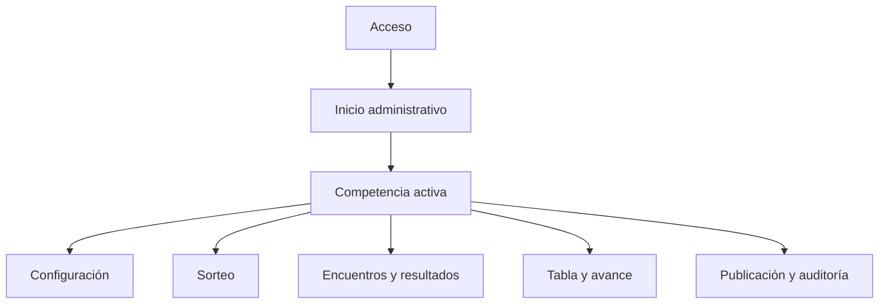
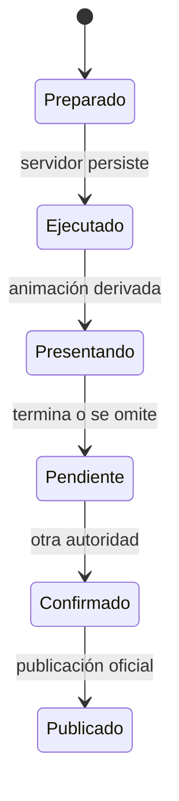

# Flujos de interfaz — Sistema Web de Competencias OES

> **Estado:** Borrador funcional 0.1.0
> **Fecha:** 6 de agosto de 2026
> **Deriva de:** `FOUNDATION.md` 2.0.0 y `docs/01-domain-model.md` a `docs/07-security-and-audit.md`
> **Autoridad:** Navegación, interacción, estados y presentación web
> **Siguiente documento:** `docs/09-test-strategy.md`

## 1. Propósito

Este documento define cómo las autoridades, operadores y público recorren el Sistema Web de Competencias OES. Convierte casos de uso, permisos y estados persistidos en navegación, pantallas y comportamientos observables.

No fija la estética final ni crea componentes de código. Define qué debe entender y poder hacer cada persona sin que la interfaz invente reglas, oculte riesgos o presente como oficial una operación todavía pendiente.

## 2. Principios de experiencia

1. La competencia activa siempre es visible.
2. El próximo paso permitido debe ser evidente.
3. Un estado pendiente nunca parece confirmado.
4. La simulación se distingue del sorteo oficial.
5. Confirmar no permite editar.
6. Las acciones destructivas muestran impacto antes de ejecutarse.
7. La interfaz representa el estado del servidor, no una suposición local.
8. La vista pública muestra únicamente información confirmada y publicada.
9. El sistema funciona en escritorio, tablet y móvil sin perder autoridad.
10. El movimiento es opcional y nunca determina el resultado.

## 3. Superficies del producto

| Superficie | Audiencia | Propósito |
| --- | --- | --- |
| Administración | Administrador y superadministrador | Configurar, ejecutar, registrar, confirmar y auditar |
| Operación | Operador y autoridades | Consultar estado interno y controlar presentación |
| Presentación | Pantallas de evento o transmisión | Mostrar un resultado ya persistido |
| Consulta pública | Público | Consultar grupos, cruces, encuentros, resultados y tablas publicados |
| Verificación | Público y autoridades | Verificar actas, evidencia y vigencia |

Las superficies pueden compartir componentes visuales, pero no permisos ni fuentes de datos incompatibles.

## 4. Arquitectura de información



### Navegación administrativa principal

- Inicio;
- Competencias;
- Confirmaciones;
- Presentación;
- Auditoría, según rol;
- Usuarios y catálogo, solo superadministrador;
- Cuenta y sesión.

La navegación no replica tablas técnicas. Agrupa tareas de la organización.

## 5. Rutas conceptuales

Las rutas finales pueden cambiar, pero la estructura debe conservarse:

```text
/admin
/admin/competitions
/admin/competitions/{competitionId}/overview
/admin/competitions/{competitionId}/participants
/admin/competitions/{competitionId}/rules
/admin/competitions/{competitionId}/draws
/admin/competitions/{competitionId}/matches
/admin/competitions/{competitionId}/standings
/admin/competitions/{competitionId}/advancement
/admin/competitions/{competitionId}/publications
/admin/confirmations
/admin/audit
/present/{publicationId}
/competitions/{competitionId}
/verify/{code}
```

Una URL administrativa no concede permiso. Abrir una ruta no autorizada produce una respuesta segura y una salida clara, no una pantalla parcialmente funcional.

## 6. Shell administrativo

### Escritorio

- barra superior fija;
- navegación lateral de ancho medio;
- selector visible de edición, evento, deporte y modalidad;
- área principal con ancho útil controlado;
- panel contextual opcional para resumen, ayuda o impacto;
- cuenta y estado de sesión accesibles desde la barra superior.

### Tablet

- barra superior fija;
- navegación lateral colapsable;
- acciones primarias permanecen visibles;
- paneles secundarios se convierten en drawer.

### Móvil

- encabezado compacto con competencia activa;
- navegación mediante drawer accesible;
- una acción primaria por zona;
- tablas se transforman en filas apiladas o tarjetas, no texto ilegible;
- confirmaciones y carga de resultados siguen siendo posibles;
- tareas de configuración extensa pueden recomendar escritorio sin bloquear móvil.

## 7. Contexto competitivo persistente

El encabezado administrativo muestra siempre:

`Edición / Evento / Deporte / Modalidad`

También muestra:

- estado de competencia;
- formato;
- ronda o fase actual;
- revisión de datos cuando sea útil;
- indicador de publicación;
- pendientes que afectan continuidad.

Cambiar de competencia exige una selección explícita. El sistema no conserva silenciosamente formularios o acciones de la competencia anterior.

## 8. Inicio administrativo

El inicio responde tres preguntas:

1. ¿Qué competencias existen y en qué estado están?
2. ¿Qué requiere mi atención?
3. ¿Cuál es la próxima acción válida?

### Secciones

- competencias activas;
- confirmaciones pendientes compatibles con el actor;
- resultados pendientes de otra autoridad;
- tablas o avances bloqueados;
- publicaciones con artefacto pendiente;
- alertas operativas relevantes;
- actividad reciente permitida.

No se llena con gráficos decorativos que no ayuden a operar.

## 9. Bandeja de confirmaciones

La bandeja unifica:

- sorteos pendientes;
- resultados pendientes;
- clasificaciones de grupos;
- ganadores de ronda;
- ganador final.

Cada elemento muestra:

- tipo de acción;
- competencia completa;
- iniciador o registrador;
- momento;
- revisión;
- resumen del contenido;
- si el actor actual puede confirmar y por qué.

Elementos incompatibles no muestran un botón engañoso. Pueden permanecer visibles con explicación como “Registraste este resultado; debe confirmarlo otra autoridad”.

## 10. Acceso y MFA

### Inicio de sesión

- correo;
- contraseña;
- mensaje genérico de error;
- indicador de espera si existe límite temporal;
- sin revelar si una cuenta está registrada.

### Segundo factor

- código TOTP o desafío WebAuthn;
- opción de código de recuperación;
- identificación del paso actual;
- reintentos limitados;
- retorno al destino original después de autenticar.

### Sesión expirada

El sistema conserva, cuando sea seguro, un borrador local no oficial y solicita nuevo acceso. Nunca confirma automáticamente después de reautenticar.

## 11. Lista de competencias

Filtros:

- edición;
- evento;
- deporte;
- modalidad;
- estado.

Cada fila o tarjeta muestra la identidad completa, estado, formato, fase y próxima acción. Crear competencia solo aparece para roles autorizados.

No se usa únicamente color para diferenciar Colegiales y Universitarios.

## 12. Creación de competencia

El flujo se divide en cuatro pasos:

1. Identidad: edición, evento, deporte y modalidad.
2. Participantes: instituciones habilitadas.
3. Plantilla: resultado, puntos, métricas y desempates.
4. Formato: grupos o eliminación directa y parámetros.

El progreso es guardado como borrador en servidor. Avanzar de paso no congela nada.

La pantalla final presenta un resumen y faltantes antes de permitir el bloqueo.

## 13. Participantes

La vista contiene:

- buscador de instituciones compatibles con el evento;
- lista habilitada;
- contador total;
- advertencia de duplicados;
- impacto sobre configuraciones de grupos posibles;
- estado de edición o bloqueo.

Después de bloquear, los controles de alta y retiro desaparecen y se muestra la instantánea congelada.

El selector nunca ofrece instituciones de otro evento como si fueran elegibles.

## 14. Plantilla competitiva

### Estructura

- perfil de resultado;
- política de desenlace;
- puntos por desenlace;
- métricas habilitadas;
- lista ordenada de desempates;
- resolución eliminatoria;
- estado y revisión.

### Interacción

- reordenar desempates mediante botones accesibles además de arrastrar;
- validar incompatibilidades al editar y al guardar;
- mostrar una vista legible del reglamento resultante;
- distinguir ejemplo conceptual de valor configurado;
- confirmar congelamiento con resumen completo.

Una plantilla congelada se presenta como solo lectura. No existe una falsa opción “editar” que después falle.

## 15. Configuración de grupos

El administrador introduce la cantidad de grupos. La interfaz calcula inmediatamente:

- si cumple `3G ≤ N ≤ 4G`;
- tamaños previstos;
- qué grupos A, B, C… reciben lugares adicionales;
- cantidad total de encuentros resultantes.

Ejemplo de resumen:

```text
11 participantes / 3 grupos
A: 4, B: 4, C: 3
Encuentros: 6 + 6 + 3 = 15
```

La cantidad inválida se explica; el cliente no intenta corregirla silenciosamente.

## 16. Configuración eliminatoria

La vista muestra:

- participantes elegibles confirmados;
- número de ronda;
- cantidad de cruces;
- necesidad de pase libre;
- regla de elegibilidad basada en historial;
- ausencia de bombos y cabezas de serie.

No permite elegir manualmente quién recibe el pase ni construir cruces desde la interfaz.

## 17. Bloqueo de competencia

Antes de bloquear se muestra un checklist:

- identidad competitiva;
- participantes y cantidad;
- plantilla completa;
- formato y parámetros;
- ausencia de pendientes incompatibles;
- efectos del bloqueo.

El diálogo exige confirmar que participantes y reglas dejarán de ser editables. Tras éxito, la pantalla vuelve a leer el estado del servidor y muestra la revisión congelada.

## 18. Simulación de sorteo

La simulación utiliza una superficie claramente rotulada:

- banda persistente “SIMULACIÓN — NO OFICIAL”;
- resultado temporal;
- semilla o evidencia diferenciada de la oficial;
- acción para ejecutar otra simulación;
- ausencia de publicar o cargar resultados;
- explicación de que no genera encuentros oficiales.

Una captura de simulación debe seguir mostrando su carácter no oficial.

## 19. Preparación del sorteo oficial

La pantalla previa muestra:

- competencia y ronda;
- lista congelada;
- configuración;
- versión del algoritmo;
- número de encuentros que se crearán;
- responsable que ejecutará;
- necesidad de confirmación independiente.

La acción se denomina “Ejecutar sorteo oficial”, no “Probar” ni “Continuar”. Requiere confirmación explícita.

## 20. Ejecución y presentación del sorteo



La animación:

- consume el resultado persistido;
- puede omitirse;
- respeta reducción de movimiento;
- no vuelve a aleatorizar;
- no revela una semilla privada antes de autorización;
- no retrasa la disponibilidad del resultado para revisión.

Cerrar o recargar durante la animación restaura el sorteo ejecutado, no lo repite.

## 21. Confirmación del sorteo

El confirmador ve:

- competencia y configuración;
- participantes congelados;
- grupos, cruces o pase libre;
- hashes y versión relevantes;
- identidad del ejecutor;
- revisión exacta;
- encuentros que se generarán.

Solo puede aceptar o rechazar conforme al flujo. Confirmar no ofrece controles para cambiar un integrante o cruce.

Si el actor es el ejecutor, se explica la prohibición y se ofrece volver a la bandeja.

## 22. Resultado confirmado del sorteo

Después de confirmar:

- se muestran grupos o llave oficial;
- se confirma la cantidad de encuentros generados;
- aparece acceso a encuentros;
- se habilita publicación;
- se muestra trazabilidad básica;
- el estado visual cambia de pendiente a confirmado sin depender solo del color.

Un pase libre aparece como “Avanza por pase libre” y no como partido ganado 0–0 o encuentro inexistente.

## 23. Publicación del sorteo

La pantalla de publicación permite:

- revisar qué información será pública;
- generar identificador y código;
- comprobar estado del acta;
- publicar una revisión confirmada;
- copiar enlace público;
- descargar acta cuando esté disponible;
- abrir verificador.

Si el PDF está pendiente, se informa sin afirmar que el acta está disponible. La carga canónica permanece identificada.

## 24. Lista de encuentros

Filtros:

- grupo o ronda;
- participante;
- estado del resultado;
- pendientes del actor.

Cada encuentro muestra:

- origen lógico;
- secuencia;
- participantes;
- estado;
- resultado confirmado o pendiente según permiso;
- acción permitida.

No muestra campos ficticios de fecha, hora, sede, cancha o árbitro, porque están fuera de alcance.

## 25. Registro de resultado por marcador

Flujo:

1. Seleccionar encuentro pendiente.
2. Verificar participantes y plantilla.
3. Ingresar marcador A y B.
4. Completar resolución eliminatoria si la plantilla la exige.
5. Revisar resumen.
6. Enviar para confirmación.

La interfaz no solicita puntos de tabla, ganador manual ni posición. Los deriva el servidor.

Después de enviar, bloquea la revisión presentada y muestra “Pendiente de otra autoridad”.

## 26. Registro de resultado por sets

La captura permite:

- agregar los sets requeridos por la plantilla;
- ingresar puntos de A y B;
- ver sets ganados derivados;
- detectar sets incompletos o imposibles;
- eliminar solo sets del borrador;
- revisar el ganador derivado antes de enviar.

No permite editar sets después de presentar el resultado. Corregir exige rechazar el pendiente o anular y reemplazar uno confirmado.

## 27. Confirmación de resultado

El confirmador ve en una comparación legible:

- participantes;
- resultado completo;
- perfil y plantilla;
- ganador derivado cuando aplica;
- impacto previsto: tabla o avance;
- registrador;
- revisión y momento.

Las acciones son confirmar o rechazar con motivo conforme a permisos. No existe edición en la pantalla de confirmación.

Al rechazar, el resultado conserva la revisión y el motivo como evidencia, el encuentro vuelve a pendiente de carga y ninguna tabla, avance o publicación cambia. El registrador puede presentar una nueva revisión.

Al confirmar, se muestra el resultado oficial y la tabla recalculada o ganador derivado desde la respuesta autoritativa.

## 28. Tabla de posiciones

La tabla muestra solamente métricas habilitadas para el deporte:

- posición;
- participante;
- jugados, ganados, empatados y perdidos aplicables;
- puntos de tabla;
- diferencias y métricas deportivas aplicables;
- estado parcial, completo o empate no resuelto.

Características:

- encabezados comprensibles y abreviaturas explicadas;
- celdas numéricas centradas y alineadas;
- criterio de desempate accesible por fila;
- indicador de resultados fuente;
- sin controles de edición.

En móvil, cada participante puede mostrarse como fila expandible manteniendo comparación de posición y puntos.

## 29. Explicación de desempates

Al abrir una posición se muestra:

1. criterio aplicado;
2. conjunto de participantes empatados;
3. valores comparados;
4. mini-tabla de enfrentamiento directo si corresponde;
5. siguiente criterio usado;
6. resultado o bloqueo final.

Si el empate no se resuelve, la UI no inventa un orden alfabético. Muestra “Clasificación bloqueada” y el mecanismo oficial pendiente.

## 30. Propuesta de clasificación

Cuando un grupo está completo:

- se muestran tabla final y resultados fuente;
- posición 1 y 2 aparecen como propuestos;
- se explica que no existen mejores terceros;
- se identifica quién puede confirmar;
- la próxima ronda permanece bloqueada.

La UI no permite sustituir manualmente un clasificado. Un error exige corregir la fuente o resolución oficial.

## 31. Avance eliminatorio

La vista de ronda muestra:

- cruces y resultados;
- ganadores derivados;
- pase libre;
- pendientes;
- propuesta de conjunto para la ronda siguiente.

Después de confirmar el conjunto, la acción primaria es “Preparar nuevo sorteo”. No se generan cruces automáticos por posición.

## 32. Finalización

La pantalla final reúne:

- ronda decisiva;
- resultado confirmado;
- ganador propuesto;
- evidencia y trazabilidad;
- confirmación final pendiente o completada;
- publicación final.

Finalizar deshabilita nuevos sorteos y resultados. La interfaz explica que una corrección posterior requiere anulación formal del superadministrador.

## 33. Anulación y reemplazo

Solo el superadministrador ve la acción. El flujo exige:

1. reautenticación o verificación de sesión reforzada cuando la política lo requiera;
2. motivo obligatorio;
3. vista previa del impacto;
4. dependencias que se invalidarán o bloquearán;
5. confirmación explícita;
6. resultado de la operación y siguiente acción.

No se usan mensajes vagos como “¿Estás seguro?”. Debe nombrarse el sorteo, resultado o avance afectado.

Si existe actividad posterior incompatible, la UI bloquea la anulación simple y explica la revisión requerida.

## 34. Auditoría

La vista autorizada permite filtrar por:

- competencia;
- actor;
- acción;
- recurso;
- intervalo temporal;
- correlación.

Cada entrada muestra antes y después de la revisión, motivo y vínculos relacionados. Los administradores ven solo el alcance permitido; el superadministrador accede al historial completo.

Exportar auditoría es una acción explícita, limitada y auditada.

## 35. Gestión de cuentas

Solo superadministrador:

- lista cuentas y estado;
- crea una cuenta individual;
- asigna o retira roles;
- exige activación y MFA;
- revoca sesiones;
- bloquea o deshabilita;
- inicia recuperación controlada;
- revisa expiración de cuentas temporales.

La pantalla impide retirar el último superadministrador activo y explica el motivo.

## 36. Operación de presentación

La superficie de control permite:

- seleccionar una publicación confirmada;
- previsualizarla;
- abrir pantalla completa;
- avanzar entre escenas visuales ya derivadas;
- mostrar u ocultar detalles públicos permitidos;
- reiniciar una animación visual sin repetir el sorteo;
- volver al resultado estático.

El operador no puede crear, confirmar, publicar ni anular datos.

## 37. Pantalla pública de competencia

Estructura:

- identidad de competencia;
- estado y fase;
- navegación entre grupos o llave, encuentros, resultados y tabla;
- clasificados o ganador cuando estén confirmados;
- enlace de acta y verificación;
- marca temporal de última actualización.

No muestra menús administrativos, pendientes internos, actores, correos o auditoría reservada.

## 38. Grupos públicos

Cada grupo muestra:

- etiqueta;
- participantes en orden publicado;
- encuentros confirmados y pendientes;
- tabla publicada;
- clasificados confirmados.

La vista diferencia “tabla parcial” de “clasificación confirmada”. Estar primero temporalmente no se presenta como clasificado.

## 39. Llave pública

La llave:

- se adapta horizontalmente en escritorio;
- usa vista por rondas o tarjetas en móvil;
- muestra pase libre sin partido ficticio;
- diferencia ganador de resultado pendiente;
- permite abrir detalle de encuentro;
- identifica sorteos separados por ronda.

No dibuja una continuidad fija entre rondas que se re-sortean. Cada ronda debe visualizarse como sorteo independiente conectado por el conjunto de clasificados.

## 40. Verificador público

Entrada:

- código completo o enlace directo.

Salida:

- estado: vigente, reemplazado o anulado;
- identificador;
- competencia y ronda;
- fecha oficial;
- participantes congelados;
- configuración;
- algoritmo y versión;
- semilla revelada cuando corresponda;
- resultado y SHA-256;
- acta descargable;
- relación de reemplazo.

Un código inválido devuelve un mensaje genérico y permite reintentar dentro de límites.

## 41. Estados de carga

Toda pantalla de datos define:

- estado inicial;
- carga;
- éxito con datos;
- éxito vacío;
- error recuperable;
- error no recuperable;
- permiso insuficiente;
- sesión expirada;
- estado obsoleto;
- sin conexión.

El skeleton conserva la estructura aproximada y no imita datos oficiales inexistentes.

## 42. Estado vacío

Un vacío explica:

- qué falta;
- por qué todavía no existen datos;
- quién puede resolverlo;
- acción válida, si el actor tiene permiso.

Ejemplos:

- “Aún no hay encuentros: el sorteo oficial debe confirmarse”.
- “No hay resultados pendientes de tu confirmación”.
- “La tabla aparecerá al confirmar el primer resultado”.

## 43. Errores y recuperación

Los errores contienen:

- mensaje humano;
- código normativo accesible en detalle;
- acción posible;
- identificador de correlación;
- conservación segura del formulario cuando aplica.

No se muestra stack trace ni mensaje SQL.

Para conflictos de revisión, la interfaz ofrece recargar la versión actual y comparar cambios; no reenvía automáticamente contenido obsoleto.

## 44. Conectividad y reintentos

Si se pierde conexión:

- un formulario no enviado puede conservarse localmente como borrador;
- una operación enviada queda como “estado por verificar”, no confirmada;
- el cliente consulta el servidor;
- un reintento usa la misma clave idempotente;
- nunca crea una nueva ejecución por incertidumbre.

El indicador de conexión no reemplaza la revisión de cada recurso.

## 45. Actualización en tiempo real

Al recibir un evento:

- se compara la revisión;
- se actualiza o invalida la consulta correspondiente;
- se muestra un aviso no intrusivo si el actor está editando;
- no se sobrescribe un formulario activo;
- no se reproducen animaciones automáticamente en pantallas administrativas.

La reconexión realiza una consulta completa. No asume haber recibido todos los eventos.

## 46. Notificaciones internas

Solo dentro de la aplicación:

- confirmación requerida;
- resultado confirmado o rechazado;
- tabla recalculada;
- avance disponible;
- publicación o acta lista;
- conflicto o acción invalidada.

Mensajería externa, correo, SMS y push están fuera de alcance. La UI no debe insinuar que esas notificaciones fueron enviadas.

## 47. Acciones y jerarquía visual

- una acción primaria por sección;
- acciones secundarias agrupadas;
- anulación separada visualmente;
- confirmar y publicar no comparten etiqueta;
- cancelar nunca ocupa la posición de confirmar por accidente;
- botones expresan verbo y objeto: “Confirmar resultado”, “Publicar sorteo”;
- estados no se presentan como botones.

El orden de tabulación coincide con la prioridad visual.

## 48. Sistema de espaciado y tipografía

Lineamientos iniciales:

- tamaño base de texto de 16 px;
- escala de espaciado basada en 4 px;
- títulos con peso suficiente para jerarquía;
- ancho de lectura controlado para textos largos;
- datos tabulares alineados consistentemente;
- objetivos táctiles mínimos de 44 por 44 px;
- zoom del navegador sin pérdida de función;
- no se reduce texto para hacer caber una tabla.

Estos valores orientan accesibilidad; la identidad visual final se deriva después sin romperlos.

## 49. Color e iconografía

- el color no comunica estado por sí solo;
- cada estado combina texto, forma o icono;
- contraste mínimo conforme a WCAG AA;
- iconos tienen etiqueta accesible cuando son acciones;
- Colegiales y Universitarios se distinguen por nombre visible además de cualquier color;
- rojo se reserva para error o acción destructiva, no para decoración dominante en controles.

## 50. Movimiento

Las animaciones deben:

- respetar `prefers-reduced-motion`;
- ser omitibles;
- no bloquear revisión;
- no usar parpadeo peligroso;
- no cambiar el resultado persistido;
- conservar una representación estática equivalente;
- evitar duración excesiva en operaciones repetidas.

La experiencia del sorteo puede ser expresiva, pero la confianza proviene de la evidencia, no del espectáculo.

## 51. Accesibilidad

Objetivo mínimo: WCAG 2.2 nivel AA.

- navegación completa por teclado;
- foco visible y orden lógico;
- enlace para saltar al contenido;
- regiones, encabezados y landmarks semánticos;
- etiquetas y errores asociados a campos;
- anuncios discretos mediante live regions;
- tablas con encabezados correctos;
- diálogos con foco contenido y retorno al disparador;
- alternativas a arrastrar y animar;
- idioma de página declarado;
- mensajes comprensibles, no solo códigos.

## 52. Responsive por tarea

| Tarea | Escritorio | Tablet | Móvil |
| --- | --- | --- | --- |
| Configuración extensa | Dos columnas y resumen lateral | Una columna + drawer | Pasos lineales |
| Sorteo/presentación | Control + vista previa | Control apilado | Control esencial |
| Resultado | Formulario y contexto juntos | Secciones apiladas | Formulario compacto |
| Tabla | Tabla completa | Desplazamiento controlado | Filas expandibles |
| Llave | Rondas horizontales | Zoom o ronda enfocada | Navegación por ronda |
| Auditoría | Tabla con filtros | Filtros colapsables | Tarjetas y detalle |

Responsive no significa comprimir la versión de escritorio; cambia la representación sin perder información.

## 53. Contenido y lenguaje

- español claro y consistente;
- términos del dominio, no nombres técnicos de tablas;
- fechas y horas en zona operativa de OES, guardadas en UTC;
- números y marcadores sin ambigüedad;
- “pendiente”, “confirmado”, “publicado”, “anulado” y “reemplazado” no se usan como sinónimos;
- acciones críticas explican consecuencia antes de confirmar;
- códigos técnicos quedan disponibles para soporte, no como mensaje principal.

## 54. Privacidad visual

- correos y roles no aparecen en vista pública;
- bandejas administrativas no se incluyen en presentación;
- modo presentación elimina navegación y datos internos;
- al compartir enlace se usa URL pública, no administrativa;
- el autocompletado de contraseña sigue prácticas seguras;
- datos sensibles no se colocan en título de página, URL o analítica.

## 55. Telemetría de experiencia

Si se incorpora analítica, solo mide:

- rendimiento;
- errores y correlación;
- rutas o acciones agregadas;
- uso de tamaño de pantalla y reducción de movimiento;
- tiempos operativos sin contenido sensible.

No captura contraseñas, MFA, semillas, resultados pendientes, observaciones, auditoría ni texto de formularios.

## 56. Criterios de aceptación UI

1. La competencia activa es visible en toda mutación.
2. Un actor no puede confundir Colegiales con Universitarios.
3. Una simulación permanece marcada como no oficial.
4. Recargar durante el sorteo no lo vuelve a ejecutar.
5. El ejecutor no puede confirmar su sorteo.
6. El registrador no puede confirmar su resultado.
7. Confirmar nunca permite editar el contenido.
8. Un resultado pendiente no aparece como público.
9. La tabla no contiene controles de puntos o posiciones.
10. Un empate no resuelto bloquea y se explica.
11. Un pase libre no aparece como encuentro.
12. Cada ronda eliminatoria se presenta como nuevo sorteo.
13. Una anulación muestra impacto y exige motivo.
14. El operador no accede a mutaciones.
15. La vista pública no filtra datos internos.
16. Escritorio, tablet y móvil completan las tareas esenciales.
17. Teclado y reducción de movimiento conservan funcionalidad.
18. Un conflicto de revisión no sobrescribe datos.
19. Una pérdida de red no genera duplicados.
20. La verificación pública muestra vigencia y evidencia.

## 57. Escenarios de prueba visual

### Flujo A — Sorteo de grupos

Crear competencia, configurar 11 participantes y 3 grupos, bloquear, simular, ejecutar oficialmente, presentar, confirmar con otra cuenta, verificar 4/4/3, generar 15 encuentros y publicar.

### Flujo B — Resultado y tabla

Registrar un resultado por una cuenta, confirmar con otra, comprobar que la tabla cambia solo después de confirmar y abrir la explicación del criterio aplicado.

### Flujo C — Eliminación con pase libre

Visualizar ronda impar, pase libre explícito, cruces, resultados, propuesta de ganadores y preparación de nuevo sorteo sin continuidad fija falsa.

### Flujo D — Conflicto

Dos autoridades abren la misma revisión, una confirma y la otra recibe conflicto con opción de recargar, sin sobrescritura.

### Flujo E — Anulación

Superadministrador abre impacto, proporciona motivo, confirma, observa invalidación y registra reemplazo sin perder historial.

### Flujo F — Accesibilidad

Completar acceso, selección de competencia, registro y confirmación usando teclado, zoom, lector de pantalla y reducción de movimiento.

## 58. Decisiones diferidas

Este documento no fija:

- logotipo, colores finales o tipografías de marca;
- biblioteca concreta de componentes;
- diseño visual pixel-perfect;
- tecnología final de gráficos o llave;
- microcopys completos;
- ilustraciones o recursos audiovisuales;
- analítica específica;
- nombres definitivos de rutas.

Estas decisiones se toman durante implementación visual sin contradecir los flujos.

## 59. Gate de flujos UI

El documento se considera aprobable cuando:

1. Cada rol tiene una superficie coherente con sus permisos.
2. La navegación usa tareas y no tablas técnicas.
3. La competencia activa permanece visible.
4. Configuración, bloqueo, sorteo, resultados, tabla y avance tienen flujo completo.
5. Simulación, ejecución, confirmación y publicación son estados distintos.
6. La presentación consume resultados persistidos.
7. La carga de resultados no acepta puntos o posiciones manuales.
8. Las anulaciones muestran impacto y preservan historia.
9. La consulta pública no expone datos internos.
10. Todos los estados de carga, vacío, error, conflicto y conexión están definidos.
11. Responsive y accesibilidad cubren tareas esenciales.
12. Movimiento puede omitirse sin perder información.
13. Seguridad y doble control son visibles y no se debilitan.
14. Los criterios de aceptación pueden convertirse en pruebas.
15. `docs/09-test-strategy.md` puede derivar escenarios sin inventar comportamiento.

Si una composición visual vuelve confuso el estado oficial o la autoridad, debe cambiarse la composición; no se simplifica la regla de dominio.
